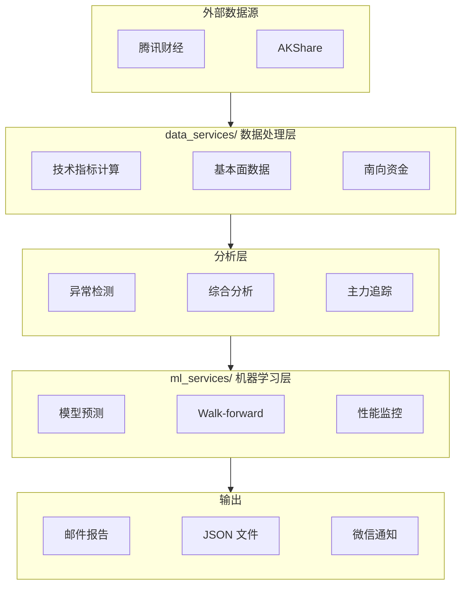

# 金融资产智能分析系统 - opencode 规则

> 本文件是 opencode 的规则入口，已通过 `opencode.json` 的 `instructions` 字段自动加载。
> **📚 详细文档**：特征工程、验证方法等完整指南请查看 [docs/README.md](docs/README.md)（文档索引，含"该看哪份"导航）
> **⚠️ 经验教训**：关键警告和最佳实践请参阅 [lessons.md](lessons.md)
> **🔧 编程规范**：开发流程、系统设计决策请遵守 [docs/programmer_skill.md](docs/programmer_skill.md)
> **📅 进度跟踪**：[progress.txt](progress.txt) - 项目当前进展
> **📖 完整说明**：[README.md](README.md) - 项目详细介绍

---

## 📋 项目概览

**双市场支持**：
- 🇭🇰 **港股** - 恒生指数三周期预测、个股预测、异常检测（31只自选股）
- 🇨🇳 **A股** - 三周期预测、综合买卖建议、板块分析（53只股票池）

**核心理念**：人机混合智能 - 融合大模型推理能力与机器学习预测精度

---

## ⚡ 常用命令

### 测试与验证

```bash
# 语法检查（每次修改后必须执行）
python3 -m py_compile <文件路径>

# 运行所有测试
python3 -m pytest tests/ -v

# 运行单个测试
python3 -m pytest tests/test_anomaly_integrator.py -v
```

### 核心功能命令

#### 港股系统

| 任务 | 命令 | 运行时机 |
|------|------|---------|
| **恒生指数预测** | `python3 hsi_prediction.py --no-email` | 收市后 |
| **综合分析** | `./scripts/run_comprehensive_analysis.sh` 或 `python3 comprehensive_analysis.py` | ⚠️ 收市后（16:00 HKT） |
| **个股详细分析** | `python3 comprehensive_analysis.py --stocks 2318.HK` | 收市后 |
| **港股异常检测** | `python3 detect_stock_anomalies.py --mode standalone --mode-type deep` | 收市后推荐 |
| **个股Walk-forward验证** | `scripts/run_walk_forward.sh --model-type catboost --horizon 20 --use-feature-selection`（确定性 env 固化，双跑验收/复现必用；直接 python3 等价但不固化 `PYTHONHASHSEED`/线程数） |
| **降噪对照实验** | `... run_walk_forward.sh ... --top-k 30`（每折特征数；降噪路径已实证排除，见 lessons 三.37） |
| **⭐ 可复现跑（推荐）** | `python3 scripts/pin_macro_snapshot.py` 先冻结快照，再 `US_MARKET_SNAPSHOT_DIR=data/us_market_snapshot GATE_SOURCE_CSV=output/<基线>/prediction_analysis.csv scripts/run_walk_forward.sh ...`——**双冻结，缺一不可**（lessons 三.29/三.30）。验收=同配置连跑两次 CSV md5 相同 |
| **跨快照稳健性** | `python3 scripts/vintage_sensitivity.py --horizon 20 --topk 10` —— 扫描全部港股 20d 快照输出 [min,max] 区间（**禁止取最好一轮**） |
| **相对 alpha 专用校验** | `python3 scripts/rel_alpha_check.py --input <csv> --horizon 20` —— 重算 Relative_Return，**含 Fold 聚类显著性**（行级 z 是伪显著） | 成功后自动入库（见下方 Git 规范；`--no-commit` 关闭） |
| **恒指Walk-forward验证** | `python3 ml_services/hsi_walk_forward.py --train-window 12 --horizon 20` | - |
| **模型训练** | `python3 ml_services/ml_trading_model.py --mode train --horizon 20 --model-type catboost --use-feature-selection` | - |
| **生产 LightGBM 20d** | `python3 scripts/train_lightgbm_20d.py` | 20d 信号默认学习器（A/B 胜出，见 §5.18）；**1d/5d 维持 CatBoost**（§5.20/D10） |
| **模型预测** | `python3 ml_services/ml_trading_model.py --mode predict --horizon 20 --model-type catboost --use-feature-selection` | - |
| **特征选择** | `python3 ml_services/feature_selection.py --method statistical --top-k 300 --horizon 20` | - |
| **超参数调优** | `python3 ml_services/hyperparameter_tuner.py --horizon 20 --n-iter 30` | - |
| **股票网络分析** | `python3 ml_services/stock_network_analysis.py --skip-pmfg` | - |
| **回测评估（lift/方向技能）** | `python3 ml_services/backtest_eval.py --input output/<dir>/prediction_analysis.csv --horizon 20` | ⭐ 评估必用 |
| **月度护栏（净IR/PBO/DSR）** | `python3 ml_services/monthly_guardrail.py --horizon 20` | 每次 Walk-forward 后必跑，判定见 `docs/DECISIONS.md` D2 |
| **组合层复核（超额CI/逐年）** | `python3 ml_services/portfolio_backtest.py --horizon 20 --topk 10 --pred output/<dir>/prediction_analysis.csv` | 每次 20d Walk-forward 后另跑（技能阶段 5.7）；超额IR CI 下界>0 且逐年多数为正 |
| **性能监控** | `python3 ml_services/performance_monitor.py --mode all --no-email` | - |
| **风险回报率分析** | `python3 ml_services/risk_reward_analyzer.py --stocks watchlist --style moderate` | - |

#### A股系统

| 任务 | 命令 | 运行时机 |
|------|------|---------|
| **A股综合分析（完整流程）** | `./scripts/run_a_stock_analysis.sh` | ⚠️ 收市后（15:15 CST） |
| **A股模型训练** | `python3 a_stock_ml_model.py --mode train --horizon 20` | - |
| **A股模型预测** | `python3 a_stock_ml_model.py --mode predict --horizon 20 --core-only` | - |
| **A股大模型建议** | `python3 a_stock_email.py --force --no-email` | - |
| **A股综合分析** | `python3 a_stock_comprehensive_analysis.py --llm-file data/a_stock_llm_*.txt --use-cached-predictions` | - |
| **A股Walk-forward验证** | `bash scripts/run_a_stock_walk_forward.sh --horizon 20`（固化确定性 env；直接 python3 等价但不固化线程数/哈希种子） | 成功后自动入库 CSV（`--no-commit` 关闭） |

### 缓存管理

```bash
# 清除港股特征缓存（新增特征后必须执行）
rm -rf data/feature_cache/*.pkl

# 清除港股原始数据缓存
rm -rf data/stock_cache/*.pkl

# 清除A股特征缓存
rm -rf data/a_stock_feature_cache/*.pkl

# 清除A股原始数据缓存
rm -rf data/a_stock_cache/*.pkl
```

### 安装与配置

```bash
# 1. 安装依赖
pip install -r requirements.txt

# 2. 配置环境变量
cp set_key.sh.sample set_key.sh
# 编辑 set_key.sh，填写邮箱和API密钥
source set_key.sh

# 3. 验证安装
python hsi_email.py --no-email
```

> 环境变量详细配置见下方 [环境配置](#-环境配置) 章节

---

## ⚠️ 核心警告

| 警告 | 说明 |
|------|------|
| **数据泄漏** | Walk-forward准确率 >65%（个股）或 >80%（恒指）通常是数据泄漏信号。**另加两条硬检查：`Predict_Prob` 饱和成 0/1、预测 UP 组收益最大值必须 <0（若为 −1e-05 这类贴零值=恒等映射=泄漏）** |
| **判读顺序不可颠倒** | ①绝对值异常(准确率/IC/概率饱和) → ②PBO<0.5 → ③DSR≥0.95 → ④净IR CI 不跨0+lift>0 → ⑤才谈仓位。**PBO/DSR 检测不出泄漏**（实测泄漏版 PBO 0.43、DSR 1.000 全过，实际是假信号），见 lessons 三.28 |
| **静默 NaN 特征** | 外部行情(HSI/美股)为午夜时间戳、个股为收盘 16:00，裸 `merge(left_index,…)` 会整列 NaN 且**不报错**；一律走 `_align_to_index`；修对齐后必须清特征缓存再验证（lessons 三.27） |
| **取数窗口硬编码** | `period_days=1460` 曾写死在个股取数处，使 2016–2021 永远取不到（宏观修了个股漏修）；改口径须 grep 全部调用点，一律用 `period_days_needed`（lessons 三.26） |
| **验证产物完整性** | fold 异常被吞会静默产出残缺 CSV（17/38 折仍打印"验证完成"）；跑完必核对**折数/行数**（lessons 三.20，已加完整性闸门缺折即非零退出） |
| **Walk-forward 复现口径** | **同机同代码双跑现已 bit 级复现**（2026-09-28 修复互信息无种子/缓存非原子写/模型非确定参数，lessons 三.25）——不复现即 bug，用 `WF_X_DETAIL=1` 列指纹定位（`scripts/run_walk_forward.sh` 固化 env）；**跨日/跨机**对比只看 lift/护栏等决策指标，禁逐行 diff CSV（三.22）；TopK 组合层指标（39→71 期）单轮判定不可信 |
| **静态快照穿越** | 网络/情感/主题/基本面等"最新值广播到全部历史行"=未来穿越；回测须用 PIT 时点还原。**2026-10-02 实测**：A股两处（`a_stock_ml_model.py` 训练/预测路径）广播静态网络特征 → 20d 净IR 3.08/PBO 0.11 → PIT 化后 2.14/PBO 0.40（**穿越是实质污染但非全部成因**，IC 0.198→0.192 几乎不变说明主因不在网络特征。**最终证实：穿越与取数噪声都不是主因** —— 四次实验后 A股 IC 稳定 0.16~0.19，可复现基线 净IR 2.32 [0.86,4.38]/PBO 0.49）。**修 PIT 时必须同步修 `community_ids` 集合来源**——`create_market_network_interaction_features` 遍历传入列表而非 `df.unique()`，PIT 社区集合比静态多一个时，多出的社区会**静默**丢失全部 `net_constraint_*` 交叉特征 |
| **绝对准确率/胜率陷阱** | 趋势板块基准本就高；评估看 **lift（胜率−基准）** 与 **方向技能（准确率−永远看涨）**，不看绝对值 |
| **降噪救不回信号** | 已实证排除：Top500→Top30 单变量对照（同窗口/折数/学习器/快照/门槛基准），净IR 0.42→0.64 但 **CI 仍跨 0、PBO 0.41→0.54 越过门槛**、lift +0.4→+0.3pp、DSR 仍不过 → 三闸门全不过。**PBO 恶化与"top_k 成了噪声源"一致（未验证因果）**，但**路径关闭基于纪律而非该假设**——勿再调 Top50/100（等于在噪声里捞信号，违反预注册纪律）。见 lessons 三.37 |
| **个股横截面 alpha 已穷尽** | 完整管线 DSR 0.87 不过、扩池不增信号、简单模型 IC 转负（2026-09 全轮实证）；**2026-09-30 相对标签（剥离 Beta）受控复验仍未 rescue**：20d 净IR 0.55/PBO 0.66/DSR 0.927/lift −0.7pp、1d 净IR −3.07；相对方向技能仅 +2.7~4.7pp、IC 0.05~0.14 → 幅度不足以覆盖成本 → **停止投入**，见 `docs/DECISIONS.md` D1 |
| **恒指方向信号不优于持有** | 信号 Long/Flat 1/5/20d IR（−0.68/0.13/0.11）均低于买入持有（0.38/0.39/0.49） |
| **异常大跌抄底是真信号但强依赖行情** | z≤−3 持 5d 净IR 1.55 显著；但逐年依赖 2025，**仅限大盘上行期（恒指>MA200）战术使用**；短期强势过滤有害 |
| **港股个股信号多为"2025 现象"** | 多策略复核收益集中于 2025 反弹年；跨年稳健性普遍不足，须逐年看 |
| **IC 计算** | IC 必须用实际收益率，不能用二元标签；收益率计算必须与训练一致 |
| **预测阈值** | 方向判断用 **0.5**，不是 0.65 |
| **CatBoost 1天模型** | 噪音大，仅供参考 |
| **学习器不可全局替换** | LightGBM 并非全面更优：20d LGBM 赢、**5d CatBoost 更优**（lift/IR/PBO/DSR 六项全占优、2026 转负）、1d 两者净IR≤0 双停 → 换学习器必须按周期分别 A/B（§5.20/D10） |
| **深度学习模型** | LSTM/Transformer F1≈0，**不推荐** |
| **加密货币策略** | 股票异常策略**不适用于**加密货币 |
| **恒指 vs 个股** | 恒指 20d 59.1%（n_eff≈35 不显著）vs 个股 20d 51.8%（不显著）；**恒指三周期模式样本量小、个股模式样本量大但效应 ≤±2.7pp，均不可交易** |
| **高置信度风险** | 高置信度预测错误时损失可达 -73%，必须设置止损 |
| **网络社区特征一致性** | 训练时保存 `model.community_ids`，预测时使用相同社区 ID 列表 |
| **分类特征 NaN** | CatBoost 预测时必须处理分类特征 NaN，训练和预测预处理必须一致 |
| **默认值设计** | 默认值必须与有效值范围分离，使用 -1 表示"未知"，基本面特征用 NaN |
| **训练时 NaN** | 不要用 `df.dropna()` 删除所有 NaN，只删除标签和关键列 |
| **绝对值特征** | 跨股票训练时，绝对价格/成交量特征必须标准化或排除 |
| **市场情绪数据源** | 必须使用所有股票收益率计算上涨比例，与 walk-forward 验证一致 |
| **双模式预测** | 收市后预测使用 `mode='production'`（当日数据），Walk-forward 使用 `mode='backtest'`（T-1 数据） |
| **yfinance 盘中数据** | yfinance 日线数据在盘中可能不准确，推荐使用腾讯财经接口获取实时报价 |
| **复权口径一致性** | 训练/预测/评估统一用**腾讯前复权（qfq）**（港股 `get_hk_stock_data_tencent`、A股 `get_a_stock_data`）；性能监控 exit 价必须 qfq 同源，禁用 yfinance 未复权价当 exit（跨除息日 actual_return 失真，实测虚高 62%，见 lessons 三.17） |
| **校准概率与方向同口径** | Isotonic 校准后 `direction`/`pattern` 必须按**校准概率 ≥0.5** 重判（`apply_to_results` 已同步 + `rebuild_three_horizon_patterns` 重算模式），否则邮件出现「↑ 0.49」自相矛盾，见 lessons 三.19 |
| **A股涨跌停差异** | 主板10%涨跌停，创业板20%涨跌停，混合训练时需标签标准化 |
| **A股股票代码前导零** | 保存CSV时必须用字符串格式 `zfill(6)`，否则前导零丢失（002655→2655） |
| **A股样本权重** | 核心股权重3.0倍，扩展股1.0倍，训练时需传入 `sample_weight` |
| **A股数据泄漏阈值** | 个股准确率正常范围50-60%，>65%为数据泄漏信号 |
| **行级显著性=伪显著** | Walk-forward 的行级 z 值忽略折间+横截面相关（同折共享模型、同日 58 股共享同一 HSI 未来收益），有效独立观测≈**折数**而非行数。实测行级 z=6.3 → Fold 聚类 t=1.40 **p=0.167**。任何命中率/准确率/lift 的显著性必须**按 Fold 聚类后检验**（lessons 三.29） |
| **GATE 同源三依赖** | 门槛/校准器/快照/基准CSV 必须同源：①宏观 `US_MARKET_SNAPSHOT_DIR` ②分位基准 `GATE_SOURCE_CSV` ③Isotonic 校准器须随模型重训**用 OOF 重拟合**（`oof_glob`，别用生产历史——新模型无历史可拟合）。**`bear==weak` 通常是概率被压平（无 edge），不是分位算错**（lessons 三.30） |
| **跨快照数值极差** | 历史港股 20d 快照实测（10~13 轮，含修复前/后与双冻结轮）：**净IR 0.42~1.52（极差1.10）、PBO 0.14~0.77、lift −0.7~+2.3pp，判定在 🟡/🟢 间翻转**。修复前轮（0922~0928）偏高含数据缺陷；**修复后各轮均收敛于 0.42~0.61 全 🟡**（含一次非冻结重跑指标亦相同）。若挑最好一轮(0922)得 净IR 1.52/PBO 0.14/DSR 0.987 → 🟢 可升核心仓位，**实为跨日多重检验陷阱**。**结论一律取区间，禁止挑最好一轮**；复现用 `US_MARKET_SNAPSHOT_DIR` 固定输入（lessons 三.29） |
| ~~港股数据末日敏感性~~ | ❌ **已撤销（2026-10-05）**：曾加 `WALKFORWARD_DATA_END`（键去末日 + 取数截断），但**它解决的是不存在的问题** —— 港股数据源当日只到 07-30，末日本来就固定，并非需要消除的漂移源。反而引入实截断（7 月只剩 2 天、净IR 0.83→0.19）。**教训**：指标变化先问「基线是否也有此差异」——若基线末日同为 07-30，则末日不是变量 |
| **跨日回测不可复现** | `us_market_data` 缓存**仅当天有效**且是宏观特征唯一来源 → 同代码跨天跑结果不同（实测 abs20d 净IR 0.34/0.42、PBO 0.41/0.64）。三.25 的 bit 级复现**仅限同一天**；**多跑几次总能撞到三门槛全过**，禁止取最好的一次当结论 |
| **冻结必须双向落盘** | 冻结机制若只做「成功写数据」而**失败不写哨兵**，等于没冻结：每次运行都会重试，成功/失败纯看当时网络（实测商品期货 `Copper_Return_20d` 是 top 特征，r1 失败 2 次 / r2 失败 4 次 → 前 5 折指标全不一致）。**只做一半的冻结比不冻结更危险** —— 它制造「已冻结」的错觉。哨兵实现两个易错点：①`load_frozen` 须**数据优先于哨兵**（先失败后成功时真实数据会被忽略）②冻结模式下抓取失败要写 `.failed` 且后续**不再重试网络**；**A股已用 `A_STOCK_SNAPSHOT_DIR` 补齐全部 6 个 akshare 入口，2026-10-03 双跑 md5 bit 级一致** |
| **市场门槛优先分位、退化回退绝对值** | 分位法（Isotonic 阶梯使绝对阈值空转）隐含前提「模型有 edge」；**模型无 edge 时校准把概率压回基准率 → 分位锚在 0.5 → 门控静默失效**（实测 bear 通过率 17.2%→98.2%）。已加退化保护（`GATE_MIN_UNIQUE=30`/`GATE_MIN_SPREAD=0.05`），退化即回退 bear 0.70/weak 0.65。**`bear==weak` 是分布退化信号，不是分位算错**（lessons 三.30、D8） | Isotonic 阶梯使 0.65 与 0.60 通过率完全相同（空转）；熊市/弱震荡门槛用校准概率 **P92/P90 分位**（`GATE_QUANTILES`，PIT），数据源须为 walk-forward 回测分布（`prediction_history` 右尾过窄会失效），见 `docs/DECISIONS.md` D8 |

---

## 📐 数据流架构



**关键依赖关系**：
- `comprehensive_analysis.py` 整合：大模型建议 + CatBoost预测 + 异常检测 + 板块分析
- `hsi_prediction.py` 调用 `ml_services/hsi_ml_model.py` 进行CatBoost预测
- `detect_stock_anomalies.py` 使用 `anomaly_detector/` 模块的双层检测（Z-Score + Isolation Forest）
- `config.py` 定义股票板块映射 `STOCK_SECTOR_MAPPING` 和自选股列表 `WATCHLIST`（31只）
- `message_services/` 统一管理邮件和微信通知

**复权口径**（除权除息处理，全链路统一前复权 qfq）：
- 港股：`data_services/tencent_finance.py` 的 `get_hk_stock_data_tencent` 请求 `hkfqkline/...qfq`（前复权）
- A股：`data_services/a_stock_data.py` 的 `get_a_stock_data` 请求 `fqkline/...qfq`（前复权）
- 标签/特征：`Future_Return`、`Label`、`current_price`(entry) 全部基于 qfq 复权价 → 模型学的是除息调整后真实收益
- 股息特征：`ml_trading_model.py` `_add_dividend_features`（7/30天内除净日 + 12月分红次数）
- **Walk-forward 同口径**：`walk_forward_validation.py` 的 `actual_return` 用 `Future_Return`（qfq Close），
  `prediction_analysis.csv` → `backtest_eval.py`/`monthly_guardrail.py` 全部 qfq；实测与腾讯 qfq 复算一致
  （汇丰 2026-03-09 跨除息 20天 +10.03% = +10.03%）
- **性能监控 exit 价必须 qfq 同源**（`fetch_price` 用腾讯 qfq，yfinance 未复权仅兜底）——禁用未复权价当 exit（跨除息日 actual_return 失真，见 lessons 三.17）

**特征模块**（动态构建，自动同步）：
- `data_services/calendar_features.py` - 日历效应（22个特征）
- `data_services/volatility_model.py` - GARCH 波动率（4个特征）
- `data_services/regime_detector.py` - HMM 市场状态检测（10个特征）
- `ml_services/stock_network_analysis.py` - 股票网络分析（社区ID、中心性等）
- `ml_services/hybrid_volatility_model.py` - LSTM-GARCH 混合波动率（3个特征）

**消息服务模块**：
- `message_services/email_sender.py` - 统一邮件发送
- `message_services/wechat_work_bot.py` - 企业微信机器人
- `message_services/wxpusher_bot.py` - WxPusher 推送
- `message_services/notifier.py` - 统一通知接口

**A股核心模块**：
- `a_stock_config.py` - A股配置（股票池53只、板块映射、样本权重）
- `a_stock_ml_model.py` - A股模型训练与预测（1077特征）
- `a_stock_comprehensive_analysis.py` - A股综合分析（买卖建议+异常检测+板块分析）
- `a_stock_email.py` - A股大模型建议生成（通义千问）
- `a_stock_recommendation_generator.py` - 综合买卖建议生成器
- `data_services/a_stock_data.py` - A股数据获取（AKShare+腾讯财经）
- `data_services/a_stock_market_features.py` - A股市场特征（涨跌停、北向资金、跨市场联动）

**数据存储**（`data/` - 机器可读）：
- `data/hsi_models/` - 恒指CatBoost模型（.cbm）和特征配置（.json）
- `data/stock_cache/` - 原始数据缓存（7天有效期）
- `data/feature_cache/` - 特征缓存（7天有效期，170x加速）
- `data/feature_selection/` - 特征选择结果（CSV/TXT）
- `data/hsi_prediction_reports/` - 恒指预测报告（JSON）
- `data/network_features/` - 网络特征（JSON）
- `data/walk_forward_results/` - Walk-forward 验证结果（CSV/JSON）
- `data/hyperparams/` - 超参数记录（JSON）
- `data/analysis_results/` - 分析结果（CSV/JSON）

**A股数据存储**：
- `data/a_stock_models/` - A股CatBoost模型（1d/5d/20d）和特征重要性
- `data/a_stock_cache/` - A股原始数据缓存
- `data/a_stock_feature_cache/` - A股特征缓存
- `data/a_stock_network_features/` - A股网络特征（JSON）
- `data/a_stock_llm_recommendations_*.txt` - 通义千问大模型建议
- `data/a_stock_comprehensive_recommendations_*.txt` - 综合买卖建议

**输出报告**（`output/` - 人类可读）：
- `output/*.md` - Markdown 分析报告
- `output/*.txt` - 文本分析报告
- `output/*.png` - 可视化图表
- `output/*_catboost_20d/` - Walk-forward 验证结果目录
- `output/comprehensive_reports/` - 综合分析报告（知识库材料）

---

## 🏗️ 特征架构（单一真相源）

**核心原则**：特征处理逻辑只在 `ml_trading_model.py` 中维护，其他模块通过导入或方法调用复用。

```
ml_trading_model.py
├── 模块级常量
│   ├── ABSOLUTE_PRICE_FEATURES（40个绝对值特征）
│   ├── NETWORK_FEATURE_MONOTONICITY（7个网络特征单调性）
│   └── MARKET_FEATURE_MONOTONICITY（34个市场特征单调性）
│
├── BaseTradingModel 类
│   ├── get_feature_columns()     # 排除绝对值特征，返回有效特征列表
│   ├── prepare_features_for_selection()  # 特征选择专用方法
│   └── prepare_data()            # 完整特征准备
│
└── FeatureEngineer 类
    ├── 计算技术指标
    ├── 生成交叉特征
    ├── create_monotonic_interaction()  # 智能交叉（保持单调性）
    └── 处理 NaN 和默认值

feature_selection.py
└── model.prepare_features_for_selection()  # 直接调用，无需维护重复逻辑
```

### 绝对价格特征排除列表（40个）

所有绝对值特征都有标准化替代：

| 类别 | 绝对值特征 | 标准化替代 |
|------|-----------|-----------|
| 价格通道 | Channel_High/Low_20d | Channel_High/Low_Ratio_20d |
| 支撑阻力 | Support/Resistance_120d | Support/Resistance_Ratio_120d |
| 均线 | MA5~MA250 | MA_Ratio 系列 |
| 布林带 | BB_upper/lower/middle | BB_Ratio 系列 |
| ATR | ATR, ATR_MA 等 | ATR_Pct, ATR_Ratio |
| 成交额 | Turnover, Turnover_Mean/Std_20 | Turnover_Z_Score |
| 成交量 | Volume_MA7/120/250, Volume_Mean/Std_30d | Volume_Ratio 系列 |
| OBV | OBV, OBV_MA5 | OBV_Trend, OBV_Change_5d |
| VWAP | VWAP | VWAP_Ratio |
| 技术指标 | MACD, MACD_signal, TP | 比率版本 |

### 特征单调性与智能交叉

交叉特征时必须保持逻辑单调性：

| 交叉类型 | 交叉方式 | 示例 |
|---------|---------|------|
| 正向 × 正向 | 乘法 | 中心性 × 收益率 |
| 负向 × 负向 | 风险放大 | 约束度 × VIX → `-|X| × |Y|` |
| 正向 × 负向 | 风险调整 | 中心性 × VIX → `X / (|Y| + ε)` |
| 涉及中性 | 乘法 | × 日历效应 |

**关键**：市场级特征（HSI_Return、VIX 等）对所有股票同值，必须与网络社区特征交叉才能区分个股。

### 新增特征时

只需修改 `ml_trading_model.py`：

```python
# 1. 在特征计算处添加标准化特征
df['New_Ratio'] = df['New_Value'] / df['Close'].shift(1)

# 2. 如果是绝对值，添加到排除列表
ABSOLUTE_PRICE_FEATURES = [..., 'New_Value']

# 3. 如果是市场级特征，添加到 _build_market_level_features()
# 4. 定义单调性（如需要交叉）
```

**feature_selection.py 自动同步，无需修改。**

---

## 🤖 机器学习模型

### 模型可信度（Walk-forward 验证）

**恒指增强模型**（PIT/embargo 流程，恒指 2020-2025，12月训练窗口；**2026-09-26 复测**，
**2026-09-28 重跑三份预测 CSV 与 09-26 逐位相同 = 完全复现**）：

| 周期 | 实测准确率 | 95%CI | vs 随机 | 超额 lift | 评估 |
|------|-----------|-------|---------|----------|------|
| 1天 | 51.3% | [47.7%, 55.0%] | ❌ 不显著 (p=0.50) | +1.4pp (p=0.64) | 本轮无边缘 |
| 5天 | 54.8% | [46.6%, 62.7%] | ❌ 不显著 (p=0.29) | +5.7pp (p=0.45) | 样本不足 |
| 20天 | 59.1% | [42.7%, 73.7%] | ❌ 不显著 (p=0.36) | +8.5pp (p=0.63) | 样本不足 |

> 上轮（2026-09-23）为 54.1%/55.9%/57.5%，1d 那轮的 "better (p=0.03)" 本轮**未复现** → 1d 边缘不可靠。
> 恒指特征无静态快照穿越（仅价格/宏观/GARCH/regime）；5/20天因独立样本不足（n_eff ~143 / ~35）未能证实边缘。

**三周期模式**（1/5/20天预测组合，PIT/embargo 口径，697 样本；**2026-09-26**；
2026-09-28 重跑三份 CSV 逐位相同 → 本表数字继续有效）：

| 模式 | 描述 | 样本 | 20天准确率 | 同向20d基准净贡献 | p值 |
|------|------|------|-----------|------------------|-----|
| 010 | 反弹失败 | 49 | 57.1% | −0.7pp | 1.000 |
| 000 | 一致看跌 | 191 | 65.4% | +7.6pp | 0.034 |
| 001 | 下跌中继 | 110 | 55.5% | −4.9pp | 0.330 |
| 111 | 一致看涨 | 134 | 67.9% | +7.6pp | 0.078 |
| 110 | 震荡回调 | 38 | 36.8% | −21.0pp | 0.013 |
| 011 | 探底回升 | 68 | 54.4% | −5.9pp | 0.324 |
| 101 | 假突破 | 46 | 58.7% | −1.6pp | 0.881 |
| 100 | 冲高回落 | 61 | 47.5% | −10.3pp | 0.120 |

> **准确率不能直接读**：同向 20d 单独基准为 UP→60.3% / DOWN→57.8%，上表"净贡献"才是模式的边际价值；
> 8 模式 Bonferroni 校正后（α=0.00625）**全部不显著**，且与上轮结论一致 → **不构成可靠交易信号**。

**个股完整模型**（38 folds，59只股票，市场情绪过滤器启用，PIT 口径；
**2026-09-29 全量复验**，20d=LightGBM / 1d·5d=CatBoost，按 D10 分周期选型；
以下内容为去运行噪声根因修复后首轮产物，见下方 ⚠️断代注记）⭐：

| 指标 | 20d LightGBM | 5d CatBoost | 1d CatBoost |
|------|-----|----|----|
| 合并准确率 | **51.5%** [49.4, 53.6]（p=0.056 不显著） | **51.5%** [50.5, 52.5]（p=0.0044） | **51.0%** [50.5, 51.4]（p=0.0000） |
| 信号胜率 / 基准胜率 | 51.4% / 49.5% | 48.2% / 46.9% | 40.6% / 39.1% |
| **超额 lift** | **+1.9pp**（p=0.253 不显著） | +1.3pp（p=0.186 不显著） | +1.5pp（p=0.0010 显著） |
| 月度护栏 净IR [95%CI] | **1.04** [−0.05, 2.04] → 🟡 | 0.59 [−0.52, 1.68] → 🟡 | −1.89 [−2.95, −0.83] → 🔴 |
| PBO / DSR | 0.89 / 0.963 | 0.74 / 0.777 | 0.29 / 0.000 |
| 综合评分 / 平均夏普 | 77 良好 / 1.41 | 77 良好 / 1.11 | 75 良好 / 1.62 |
| 平均 IC（rank_ic） | 0.057（0.077） | 0.061（0.079） | 0.027（0.029） |

> ⚠️ **断代注记（2026-09-29）**：A+C1 去噪声修复（互信息选择固定 `random_state=42`、
> 特征缓存原子写、模型确定性参数，见 lessons 三.25）**改变了所选特征集** → 本轮数值与 09-26/09-28
> 旧代码产物**不可直接比较**，本轮起为新的口径基线。完整 38 folds / 43,610 行与旧结构一致（完整性闸门通过）。
> **判定与修复前完全同向**：20d 🟡 / 5d 🟡 / 1d 🔴——D2「维持低配」结论经复验成立。
> **1d lift 仍显著但净IR −1.89 → 按 D10/D2 停用**（微弱方向信息 ≠ 可交易组合）。
> 评估以 `ml_services/backtest_eval.py` 的 **lift / 方向技能** 为准（详见 [docs/VALIDATION_GUIDE.md](docs/VALIDATION_GUIDE.md)）。

> 🚨 **断代注记二（2026-09-30 晚）——上表及 09-30「宏观齐全 86-fold」全部作废待重刷**
> 复验相对标签时发现两处**前提级 bug**：①`prepare_data` 个股取数硬编码 `period_days=1460`
> （个股行情实际只有近 4 年，早期折 lookback 残缺，lessons 三.26）；②HSI/美股为午夜时间戳、
> 个股为收盘 16:00，按索引 merge 整列 NaN（早年午夜索引缓存掩盖之，lessons 三.27）。
> 修复后绝对基线数值已变化（实测 abs1d 净IR −0.80 → **−2.42**），**结论方向不变（1d 🔴 / 20d 🟡）**。
> **修复后干净基线（50 folds / 58 只，当前有效）**：
> 绝对 20d 净IR 0.34 [−0.68,1.33]/PBO 0.41/DSR 0.887/lift +0.2pp 🟡｜相对 20d 0.55[−0.46,1.42]/0.66/0.927/−0.7pp 🟡
> 绝对 5d −0.08[−1.07,0.87]/0.03/0.683/+0.1pp 🔴｜相对 5d 0.10[−0.87,1.09]/0.73/0.643/+0.1pp 🟡
> 相对 1d **−3.07**[−4.11,−2.10]/0.30/0.000/−0.1pp 🔴｜绝对 1d **−2.42**[−3.47,−1.45]/0.53/0.000/+0.3pp 🔴
> → **无一组合三门槛全过**；**D1 在剥离 Beta 口径下同样成立**，D2 维持低配/1d 停用。
> **修复后 PBO 普遍改善**（20d 0.94→0.41、5d 0.79→0.03）但**净IR/lift 同步下降**
> → 旧基线高 PBO 源于数据缺陷（lookback 残缺+特征NaN），非模型过拟合。
> ⚠️ **2026-10-01 对抗性审查修正**：此前"相对口径三周期方向技能一致为正
> （+2.67/+4.17/+4.71pp）→ 确有微弱相对 alpha"属**过度陈述，已撤回**。
> 那些是**行级**统计，忽略折间相关（同折共享同一模型 + 同日 58 股共享同一 HSI 未来收益），
> 有效独立观测≈折数(~50) 而非行数(~4 万)。**按 Fold 聚类重算：lift +1.41pp, t=1.40, p=0.167 → 不显著**。
> 正确表述：**相对方向技能本身未达统计显著**，不能归因于"信号存在但被成本吃掉"。
> `scripts/rel_alpha_check.py` 已加聚类修正（行级 z 会明确标注为"伪"）。
> 复验中另遇**标签中间量入模**导致 100% 准确率假信号（PBO/DSR 全过却无效，lessons 三.28）——
> **判读顺序：绝对值异常 → PBO → DSR → CI/lift → 仓位**，顺序不可颠倒。
> 专用相对校验脚本：`scripts/rel_alpha_check.py`（重算 Relative_Return，输出方向技能/IC/中性净IR）。

> **最终决策（2026-09-24）**：个股横截面 alpha 已穷尽，**停止投入**（见 [docs/DECISIONS.md](docs/DECISIONS.md) D1）。
> `20d 行业中性 TopK` 每次 Walk-forward 后跑 `ml_services/monthly_guardrail.py` 复核
> （净IR≥0.7 且 PBO<0.5 且 DSR≥0.95 才可升级，判定见 D2）。
> **2026-09-29 全量复验（修复后首轮）**：20d 净IR 0.84→**1.04**、DSR 0.940→**0.963**（过线）、
> 组合超额IR −0.11→**+0.49 [−0.71,1.45]**、P(>0)=83%——但 **PBO 0.46→0.89（>0.5 未达升级门槛）**
> → 仍 **🟡 保留低配**；5d 净IR 0.67→0.59、PBO 0.13→0.74、DSR 0.695→0.777 → 仍🟡；
> 1d 净IR −1.99→−1.89、DSR 0.000 → 仍🔴。三周期判定方向**完全不变**，D2 维持。
> 注：09-26 轮 🟢 证据链已存档于 [docs/DECISIONS.md](docs/DECISIONS.md) §四（被 09-28 复核及本轮复验取代）。

> **2026-09-30 延长历史重跑（宏观齐全，start 2016-06-01 → 86 folds / ~77.9k 行 / 组合期数 71）**：
> 目的＝用户要求"增加样本量"看能否让边缘信号显著；并修复 lessons 三.26 的宏观特征缺失（`prepare_data` 按折 `start_date` 取全历史）。结果**仍无 edge，且 PBO 恶化**：
> | 指标 | 20d LightGBM | 5d CatBoost | 1d CatBoost |
> |------|-----|----|----|
> | 合并准确率 | 50.6% [49.0,52.2]（不显著） | 51.2% [50.5,52.0]（不显著） | 51.4% [51.1,51.8] |
> | 超额 lift | +1.8pp（p=0.21 不显著） | +0.8pp（p=0.31 不显著） | +0.7pp（p=0.056 不显著） |
> ~~以上 86-fold 数值已作废~~（个股截断 1460d + HSI/美股特征 NaN）。
>
> **⭐ 当前有效基线（2026-10-02，双冻结可复现，start 2019-06-01 / 50 folds / 58 只）**：
> | 指标 | 20d LightGBM | 5d CatBoost | 1d CatBoost |
> |------|------|------|------|
> | 月度护栏 净IR [95%CI] | **0.42** [−0.63,1.34] → 🟡 | **−0.04** [−1.00,0.92] → 🔴 | **−2.64** [−3.71,−1.67] → 🔴 |
> | PBO / DSR | 0.64 / 0.837 | 0.19 / 0.551 | 0.34 / 0.000 |
> | 超额 lift | +0.4pp | +0.0pp | +0.3pp |
> → **无一组合三门槛全过**；D1「alpha 已穷尽」确认、D2「20d 🟡 低配 / 1d 🔴 停用」维持。
> **可复现性**：双冻结（`US_MARKET_SNAPSHOT_DIR` + `GATE_SOURCE_CSV`）下连跑两次
> `prediction_analysis.csv` **md5 相同**（f6a065d3…）——全链路 bit 级复现。
> **现行门槛**：`GATE_SNAPSHOT = {'bear': 0.70, 'weak': 0.65}`（分位退化后回落绝对值，lessons 三.30）。
> 09-29 的 38-fold、09-30 的 86-fold 数值均保留为历史对照，**不可引用**。

**新增利率特征**（2026-05-23）：
- 多期限美债收益率：US_2Y_Yield, US_10Y_Yield, US_30Y_Yield
- 中国国债收益率：CN_10Y_Yield
- 期限利差：US_2Y_10Y_Spread（收益率曲线斜率）, US_10Y_30Y_Spread
- 中美利差：CN_US_10Y_Spread（资金流向驱动）, CN_US_Spread_Change_5d, CN_US_Spread_Z_Score
- 通过网络交叉特征区分个股（如 `net_centrality_CN_US_10Y_Spread`）

**特征选择**：使用 Top 500 特征，特征减少 55.8%，性能优于全量特征

**Walk-forward 输出文件**（保存到 `output/YYYYMMDD_HHMMSS_catboost_20d/`）：
- `fold_metrics_detail.json` - 每个 Fold 的指标 + **Top 100 特征重要性**
- `prediction_analysis.csv` - 所有预测详情（用于 Fold 盈亏比分析）
- `validation_summary.json` - 总体验证结果

### CatBoost 配置

| 参数 | 值 | 说明 |
|------|-----|------|
| **预测阈值** | 0.5 | 概率 > 0.5 预测上涨 |
| 特征数量 | ~1450 → 500 | 推荐使用 Top 500 特征选择 |
| 随机种子 | 42（固定） | 确保可重现性 |

**20天模型参数**（超参数优化后）：

| 参数 | 值 |
|------|-----|
| n_estimators | 400 |
| depth | 8 |
| learning_rate | 0.06 |
| l2_leaf_reg | 2 |
| subsample | 0.75 |
| colsample_bylevel | 0.8 |

### 新特征上线验证清单

详见 [docs/FEATURE_ENGINEERING.md](docs/FEATURE_ENGINEERING.md)，8个验证步骤：

1. 泄漏检查 - 所有特征使用 `shift(1)`
2. **绝对值特征标准化** - 跨股票训练必须标准化
3. **市场级特征交叉** - 对所有股票同值的特征必须交叉
4. **特征单调性** - 交叉特征保持逻辑单调性
5. Walk-forward 验证 - 准确率达标
6. SHAP 排名 - 进入 top 30
7. Pearson 相关性 - 与现有特征 < 0.8
8. 随机种子稳定性 - 波动 < 2%

### 市场情绪过滤器

**核心原理**：市场上涨比例有强自相关性（lag=1 自相关系数 0.929），滞后1天数据能有效识别极端市场环境。

**阈值分层**：

| 层级 | 上涨比例 | 动态阈值 | 操作 |
|------|---------|---------|------|
| extreme_bear | <20% | 1.0 | 暂停交易 |
| bear | 20-30% | 0.70 | 高置信 |
| weak | 30-40% | 0.65 | 谨慎 |
| normal | >40% | 0.50 | 标准 |

**验证效果**：准确率 62.0% → 70.7%（+8.7%），总收益 +63.44

**代码**：`ml_services/market_regime.py` - MarketSentimentFilter 类

**使用要点**：
- 数据源：使用所有股票收益率计算上涨比例，与 walk-forward 验证一致
- 无前瞻性偏差：严格使用滞后1天数据（`lookback_days=1`）
- 生产集成：`comprehensive_analysis.py` 中已集成

### 市场状态稳定性检测

**核心原理**：HMM 市场状态持续时间（Regime_Duration）反映状态稳定性，短持续时间意味着频繁转换，预测可靠性下降。

**状态稳定性判断**：

| Regime_Duration | 稳定性 | 建议 |
|-----------------|--------|------|
| < 5 天 | ⚠️ 不稳定 | 降低仓位 |
| 5-15 天 | 🟡 中等 | 正常交易 |
| > 15 天 | ✅ 稳定 | 趋势明确 |

**代码**：`data_services/regime_detector.py` - RegimeDetector 类

**生产集成**：
- `comprehensive_analysis.py` 的 `get_current_market_state()` 函数
- 邮件报告中展示市场状态持续时间

---

## ⚙️ 环境配置

### 必填环境变量

| 变量名 | 说明 |
|--------|------|
| `SMTP_SERVER` | SMTP 服务器地址 |
| `EMAIL_SENDER` | 发件人邮箱 |
| `EMAIL_PASSWORD` | 邮箱应用密码 |
| `RECIPIENT_EMAIL` | 收件人邮箱列表 |
| `QWEN_API_KEY` | 通义千问 API 密钥 |
| `WECHAT_WORK_WEBHOOK` | 企业微信机器人 Webhook（可选） |
| `WXPUSHER_TOKEN` | WxPusher Token（可选） |
| `WXPUSHER_UIDS` | WxPusher 用户 UID（可选） |

### 主要依赖

`yfinance` `catboost` `akshare` `pandas` `scikit-learn` `lightgbm` `hmmlearn` `arch` `networkx`

---

## 🔧 开发规范

### 代码修改原则

1. **修改完即测试**：每次修改后立即执行 `python3 -m py_compile <文件>`
2. **避免硬编码路径**：使用 `os.path.dirname(os.path.abspath(__file__))` 获取脚本目录
3. **HTTP API 超时处理**：调用 API 时必须设置超时时间——**含依赖链内部请求**（akshare 等库函数常无 timeout，会静默挂死整条流水线，见 lessons 三.21）
4. **语言规范**：对话和注释使用简体中文，变量名/函数名使用英文

### 🚨 对抗性审核：三道闸（A 呈现前 / B 提交前 / C 升级前，强制，不可跳过）

**不只是"改动后"——共有三个触发时机，其中两个与"有没有改动"无关**：

| 闸 | 触发时机 | 是否依赖改动 | 判据 |
|---|---|---|---|
| **A 呈现闸** | 任何指标要作为**结论**输出前 | ❌ 不依赖 | 绝对值异常（准确率/IC/概率饱和/分组符号一致性） |
| **B 提交闸** | 任何代码/配置/文档改动后、commit 前 | ✅ 依赖 | 下方 8 项清单 |
| **C 升级闸** | 任何 🟢/升配/加仓/改阈值 决策前 | ❌ 不依赖 | 双冻结 + 双跑 md5 一致 + 禁止取最好一轮 |

> 2026-10-02 实证 A 闸不可省：当时**还没有任何代码改动**，仅因为要把 rel20d 结果
> 当结论汇报而触发，随即抓到 **100% 准确率泄漏**（PBO 0.43 / DSR 1.000 全过却是假信号）。
> 若规则只写"改动后审核"，那次根本不会触发。

**B 闸首条**：**任何代码/配置/文档改动完成后，必须像攻击对手一样攻击自己的改动**，
确认无问题才能提交。2026-10-02 一次文档同步中，靠自审发现 4 处自相矛盾
（其中 1 处会直接导致按错误仓位实盘）。

**审核清单（逐项过）**：

| # | 检查项 | 判据 / 方法 |
|---|--------|------------|
| 1 | **数值可复算** | 文档里每个关键数字都能用脚本重新算出（如跑 `vintage_sensitivity.py` 复算极差） |
| 2 | **文档↔代码一致** | 文档声称的常量/阈值/时间戳与代码实际值逐项核对（`grep` 代码确认） |
| 3 | **跨文档无矛盾** | 同一事实的多处表述（A/B/C 三份文档）互不冲突；新改动引入的表述与旧表述是否矛盾 |
| 4 | **无过期残留** | 被替换的旧值在**全部**文档中清零（`grep -c` 确认为 0），不只改一处 |
| 5 | **断言已验证** | 不得写未验证的断言；确需标注的写成「**已知待修风险**」而非结论 |
| 6 | **计数/样本量准确** | 快照数、折数、样本数等易随时间变的量，写「10~13 轮」而非固化数字 |
| 7 | **实盘文档优先** | `docs/DEPLOYMENT.md` 等操作指南若含**已证伪的仓位/阈值建议**，视为高危，必须优先修正 |
| 8 | **自身副作用** | 新机制是否在别处造成退化/失效（如门控、退化保护阈值是否波及其他市场） |

**判定标准**：任一项不通过 → 修正后重审，**不得带疑问提交**。

#### 🚨 两条硬约束（本次真实失职后补入，清单是被动的，需主动触发）

**约束 1 —— 因果结论必须先验证再写**
写任何"因为 X 所以 Y"前，先回答：**这个因果我用聚类/复算验证过吗？**
> 本次真实失职：把"方向技能 +2.67pp（行级 z=6.3）→ **确有微弱相对 alpha，只是被成本吃掉**"
> 写进 AGENTS/DECISIONS/progress 三份文档并提交。Fold 聚类后 p=0.167 **不显著**——
> 行级 z=6.3 是伪显著。**清单第 1/5 项本该拦住我，两条都没执行**。
> 规则：**行级统计不得用于因果推断**；凡"因为…所以…"必附聚类检验或复算证据。

**约束 2 —— 得出判定后必须 grep 实盘文档**
每次得出 **🟢/🟡/🔴 判定**（或任何阈值/仓位变更）后，**强制**执行：
```bash
grep -nE "仓位|放大|可升至|≤[0-9]+%|净IR [0-9]" docs/DEPLOYMENT.md README.md
```
逐条**读**命中的每一行，确认**没有与当前判定相反的建议**。
注意：**"🟢 升级 → 才可放大至 15–20%"这类条件规则是正确的，不要误删**——
要抓的是「**当前判定 🟡/🔴，却写着可直接放大**」这类**无条件的现状建议**。
> 补充（本次自审发现）：纯 grep 关键词会把条件规则也命中 → **必须逐行判读上下文**，
> 否则要么漏放真残留、要么误删正确规则。判据 = **该行的建议是否与当前判定方向一致**。
> 本次真实失职：整个会话都在更新 DECISIONS/AGENTS/lessons，
> 却**从未打开 `docs/DEPLOYMENT.md`**——而它写着"🟢 已达标 → **可放大至 15%**"，
> 该 🟢 早已被 09-28 复跑证伪。按此实盘会**加倍错误仓位**。
> 清单第 7 项（实盘文档优先）形同虚设，因为没人会主动去翻那份文件。

**反模式（本次真实踩过）**：
- ❌ 只改被指出的一处，遗漏其他文档的同源表述（→ 全库 `grep` 旧值）
- ❌ 引用历史结论而不核实其是否已被后续复验推翻（→ 09-26 的 🟢 早被证伪，却仍写在实盘指南里）
- ❌ 把固化数字写死（"10 个快照"实际会随时间增长）
- ❌ **用行级统计下因果结论**（→ 约束 1）
- ❌ **得出判定后不查实盘文档**（→ 约束 2，本次最严重缺口）

### 🔬 实验方法论：三条补充（2026-10-04 实证）

以上三闸管"提交与判定"，但**管不到"实验设计本身对不对"**。2026-10-04 连续三次实验
（港股训练窗/ A股涨跌停 / 港股门控）**全部因变量不纯而无法归因**，补三条：

**① 改动前先列「连带影响清单」**
"改一个变量"不等于"只有一个变量变"。三次失败的根因完全相同——改了 A，不知道它连带改了 B：

| 改动 | 我以为只改了 | 实际连带改了 |
|---|---|---|
| `--train-window 36→12` | 训练窗 | **测试期也变长**（50→74 折，因首折预热需求降低） |
| 剔除 2 个特征 | 特征集 | **绝对值排除列表 40→42**（同文件另一处未提交改动） |
| 加门控守卫 | 门控 | **特征缓存全量重算**（缓存键含「数据末日」，末日变→键变→重建） |

> **强制**：跑任何实验前先写「本次改动会连带改变哪些东西」。
> 常见连带面：训练窗→预热期/折数/测试期；特征→缓存键/列集/模型结构；
> 数据源→数据末日/重算范围/TTL；阈值→下游消费者。
> 判据 = **若答不出"会连带改变什么"，说明尚未理解该改动，就不该开跑。**

**② 预注册判据 > 让 AI 先复述需求**
"先总结你的理解"只能防跑偏，**防不了事后找解释**。
强版：**在看到结果之前，把"什么结果算成功/失败"写成数字或区间**。
本项目实例（2026-10-04 涨跌停实验）：判据「净IR 降幅 >30%=依赖 / 30~10%=部分 / <10%=非依赖」
→ 实测 −7.3% → 干净落入"非依赖"。若无预注册，很容易在看到「剔除强特征后几乎不变」时
自行解释成"说明还有其他机制在起作用"。

**③ 验证前先校验「数据非空」，再校验语义**
红队/对抗审核在**错误前提**上只会产出更多错误自信。
实例：曾断言「港股无绝对价格问题」，依据是港股 50 折 `top_features` **全为空数组**
——把「没看见」当成「不存在」，连续两次基于空数据下结论。
根因：`walk_forward_validation.py` 的特征重要性只认`model.catboost_model`，
而 20d 用 LightGBM（模型在 `model.model`）→ 静默降级为空。
> **强制**：用grep/统计做交叉验证时，先确认「被验证的对象本身有内容」
> （如 `len(x)>0`、行数符合预期、唯一值数 >1）。**空数据不能证伪任何命题。**

**附：软件排错 ≠ 统计推断（别混用纠偏手段）**
文档化的通用纠偏手段是「加日志、观察输出」——**在软件调试有效，在统计问题上无效**，
因为策略有没有 edge 无法打印日志。统计场景的对应工具：

| 场景 | 工具 |
|---|---|
| 是不是真信号 | **置换检验**（与随机分布比，非重叠块口径） |
| 观测是否独立 | **聚类校正**（实测行级 p=0.0001虚高至 6.8e-17） |
| 能不能升配 | **预注册 + 独立复现（md5位级比对）** |
| 结果是否可信 | **同口径双跑 + 逐列bit 级比对** |

**非专家的核心竞争力不是提问技巧，是「知道该验证什么」**——
而"该验证什么"是**过程性知识**（易学），不是**领域性知识**（难学）。
本日拦截下的全部问题（附录旧值残留、守卫装错位置、实验变量不纯、门槛源被实验污染）
**均无需量化知识即可发现**。

### 数据泄漏防护

高风险特征必须使用 `.shift(1)` 避免使用当日数据：
- 所有 `.rolling()` 计算的特征
- `future_return` 必须使用 `.shift(-N)` 计算未来收益

```python
# ❌ 错误：使用当日数据
future_return = returns.rolling(5).sum()

# ✅ 正确：使用未来数据
future_return = returns.rolling(5).sum().shift(-5)
```

### CatBoost 分类特征处理

训练和预测时必须一致处理分类特征 NaN：
```python
# 训练时
df[col] = df[col].fillna('unknown').astype(str)
encoder = LabelEncoder()
df[col] = encoder.fit_transform(df[col])

# 预测时
test_df[col] = test_df[col].fillna('unknown').astype(str)
test_df[col] = test_df[col].apply(
    lambda x: encoder.transform([x])[0] if x in encoder.classes_ else -1
)
```

### Git 提交规范

- 文件上传：只提交 `.md` 格式，不提交 `.json`/`.csv`
  - **例外**：回测 `prediction_analysis.csv` 由 `scripts/commit_backtest_result.py` 自动入库
    （分位门槛数据源，CI/本地须同源；每次入库自动 `git rm --cached` 旧的港股 20d CSV
    只留最新，防仓库膨胀；快照维护见 `ml_services/market_regime.py` 注释）
- GitHub Actions：排程控制在 cron，不在代码中重复判断
- 推送冲突：使用 `git pull --rebase`

---

## 🔄 自动化调度

| 时间 | 工作流 | 功能 | 市场 |
|------|--------|------|------|
| **06:00** (工作日) | `hsi-prediction.yml` | 恒生指数预测 | 🇭🇰 |
| **06:00** (工作日) | `batch-stock-news-fetcher.yml` | 批量个股新闻抓取 | 🇭🇰 |
| 每小时 | `hourly-crypto-monitor.yml` | 加密货币监控 | 🌐 |
| 每小时 | `hourly-gold-monitor.yml` | 黄金监控 | 🌐 |
| **16:00 HKT** (工作日) | `comprehensive-analysis.yml` | 港股综合分析 | 🇭🇰 |
| **00:00 HKT** (工作日) | `performance-monitor.yml` | 性能报告（仅港股，含 lift/方向技能/护栏状态） | 🇭🇰 |
| 周日 09:00 HKT | `weekly-comprehensive-analysis.yml` | 港股周度综合分析 | 🇭🇰 |
| 周日 11:00 CST | `weekly-a-stock-comprehensive-analysis.yml` | A股周度综合分析 | 🇨🇳 |
| 周一 08:00 HKT | `test-llm-api.yml` | LLM API 连通性测试 | - |

> 注：`hourly-stock-monitor`/`stock-anomaly-detection`/`a-stock-comprehensive-analysis`
> （每日15:15）已随 `78421801`/`5026cf0c` 清理，以 `.github/workflows/` 实际文件为准。

---

## 📝 会话工作流

**会话开始时**：读取 `progress.txt` 了解项目进展，审查 `lessons.md` 检查错误

**对抗性审核有三个触发时机（见 [开发规范](#-开发规范)）**：
- **指标呈现前**：任何数字要作为结论汇报时，先查绝对值异常（可能一个字都没改）
- **改动提交前**：任何代码/配置/文档改动后，攻击自己的改动再 commit
- **升级决策前**：任何 🟢/升配/加仓/改阈值前，双冻结 + 双跑 md5 一致

2026-10-02 实证两次：①**未改任何代码**，仅因汇报 rel20d 结果触发 A 闸，
抓到 100% 准确率泄漏（PBO 0.43/DSR 1.000 全过却是假信号）；
②文档同步触发 B 闸，发现 4 处自相矛盾，其中 `DEPLOYMENT.md` 仍写着
已被证伪的「🟢 可放大至 15%」——若照此实盘会**加倍错误仓位**。

**功能更新后**：更新 `progress.txt` 记录进展，如有新学习心得更新 `lessons.md`

**模型更新后**：运行 Walk-forward 验证确认性能，使用 `/model_validation` 命令执行标准验证流程

**特征修改后**：清除缓存 `rm -rf data/feature_cache/*.pkl`

---

## 🔗 快速链接

- **经验教训**：[lessons.md](lessons.md) - 关键警告和最佳实践
- **进度跟踪**：[progress.txt](progress.txt) - 项目当前进展
- **特征工程**：[docs/FEATURE_ENGINEERING.md](docs/FEATURE_ENGINEERING.md) - 完整指南（含案例分析）
- **三周期分析**：[docs/THREE_HORIZON_ANALYSIS.md](docs/THREE_HORIZON_ANALYSIS.md)
- **验证方法**：[docs/VALIDATION_GUIDE.md](docs/VALIDATION_GUIDE.md)
- **模型改进计划**：[docs/MODEL_IMPROVEMENT_PLAN.md](docs/MODEL_IMPROVEMENT_PLAN.md) - 业界基准驱动的分阶段计划 ⭐
- **决策备忘**：[docs/DECISIONS.md](docs/DECISIONS.md) - 个股 alpha 停止投入等关键决策 ⭐
- **建设方法论**：[docs/QUANT_SYSTEM_METHODOLOGY.md](docs/QUANT_SYSTEM_METHODOLOGY.md) - 五层结构 / 七原则 / 七阶段建设步骤 / 三道闸门 ⭐
- **量化交易误解**：[docs/量化交易误解-正式文档.md](docs/量化交易误解-正式文档.md) - 方法论注脚：四道陷阱（看图确认偏差/除权除息/正态肥尾/回测过拟合）与 lessons/DECISIONS 逐条对应 ⭐
- **实盘部署**：[docs/DEPLOYMENT.md](docs/DEPLOYMENT.md) - 底仓+战术+风控与月度护栏 ⭐
- **A股设计**：[docs/A_STOCK_DESIGN.md](docs/A_STOCK_DESIGN.md) - A股系统完整设计文档
- **SSH认证**：[docs/SSH_SETUP.md](docs/SSH_SETUP.md) - 新电脑配置 GitHub SSH 认证指南