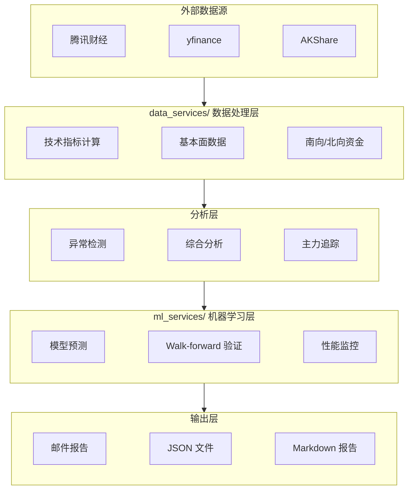
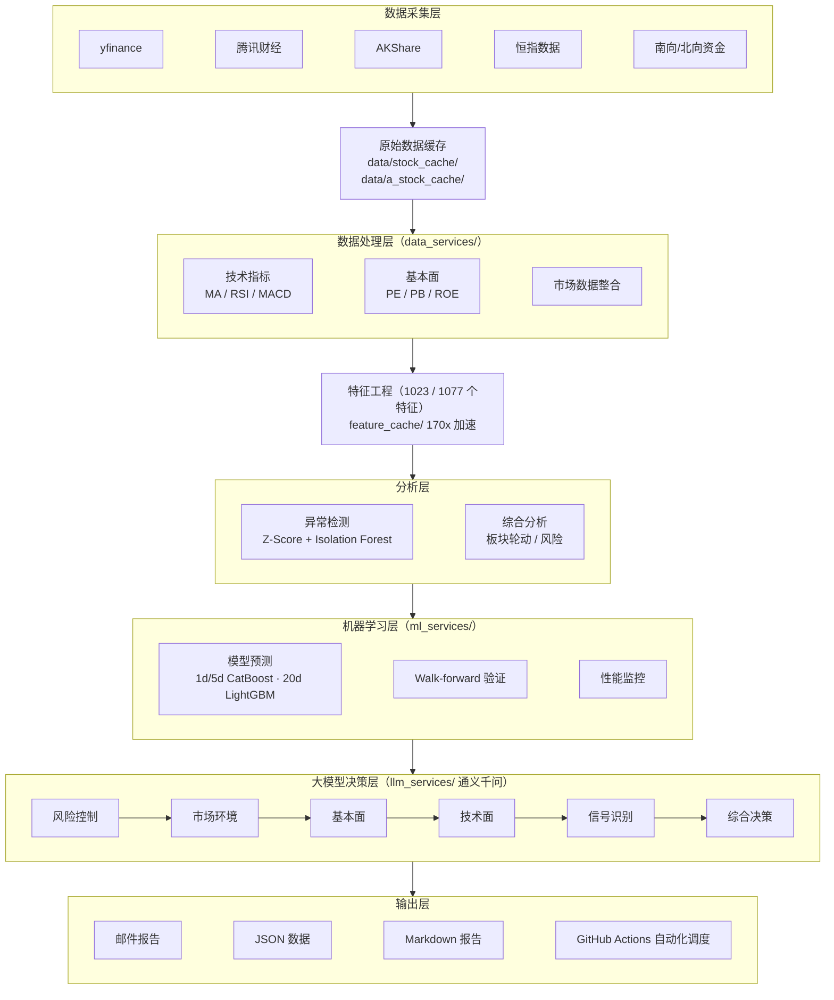
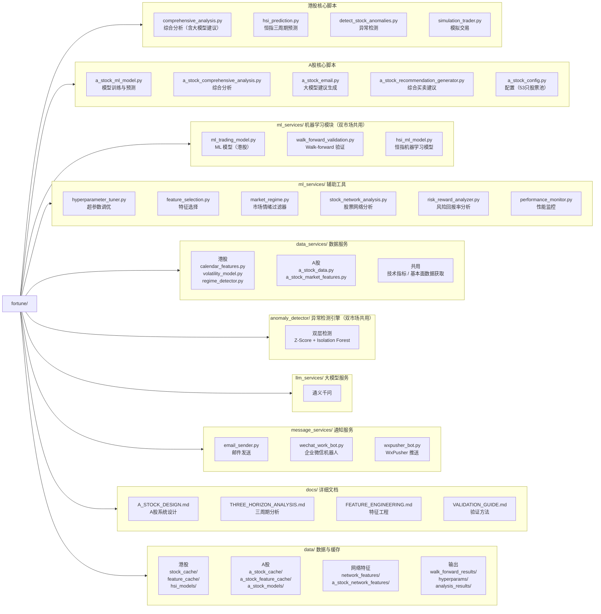

#  金融资产智能分析与交易系统

**⭐ 如果您觉得这个项目有用，请先给项目Star再Fork，以支持项目发展！⭐**

实践**人机混合智能**的理念，开发具备变现能力的金融资产智能量化分析助手。系统整合**大模型智能决策**与**机器学习预测模型**，实时监控**港股**、**A股**两大市场。

**支持市场**：
- 🇭🇰 **港股** - 恒生指数三周期预测、个股预测、异常检测（31只自选股）
- 🇨🇳 **A股** - 三周期预测、综合买卖建议、板块分析（53只股票池）

---

## 📄 效果文档

- 📊 [港股综合分析报告](output/comprehensive_reports) - 每日港股买卖建议
- 📊 [A股综合分析报告](output/comprehensive_reports) - 每日A股买卖建议

---

## 一、核心功能

### 1.1 项目优势

**人机混合智能**：融合大模型推理能力与机器学习预测精度，既保持量化分析的客观性，又具备理解市场上下文的灵活性。相比纯量化策略，能更好地应对市场突发事件和非理性行为。

**经过验证的策略**：交易策略均经过历史数据回测和 Walk-forward 验证（PIT/embargo 口径），评估以 lift/方向技能为准。

**全流程自动化**：从数据采集、特征计算、模型预测到邮件推送，全流程自动化运行。GitHub Actions定时调度，无需人工干预，确保不错过任何交易机会。

**双市场支持**：专门针对港股和A股市场特性优化，包括南向资金追踪（港股）、北向资金追踪（A股）、涨跌停特征（A股）、板块轮动研究等。相比通用量化工具，更能把握各市场规律。

**多维度交叉验证**：单一指标可能失效，但多维度信号共振可显著提高可靠性。系统整合三周期预测、异常检测、大模型分析、板块轮动四大维度，只有多信号一致时才给出强建议。

**透明的性能监控**：每日自动评估预测，报告**基准扣除后的诚实指标**（方向技能=准确率−永远看涨、
超额 lift=信号净胜率−无条件买入基准、逐年分解）与 `20d 中性 TopK` 护栏判定，真实反映系统表现。
不隐藏失败预测，持续迭代改进。

### 1.2 双市场支持概览

| 特性 | 🇭🇰 港股系统 | 🇨🇳 A股系统 |
|------|-------------|------------|
| **股票池** | 31只自选股 | 53只（4核心+49扩展） |
| **三周期预测** | ✅ 1d/5d/20d | ✅ 1d/5d/20d |
| **指数预测** | ✅ 恒生指数（20d 59.1%，PIT 实测但不显著） | ❌ 暂不适用 |
| **大模型建议** | ✅ 通义千问 | ✅ 通义千问 |
| **异常检测** | ✅ 双层检测（Z-Score + IF） | ✅ 双层检测 |
| **市场情绪** | ✅ 南向资金 | ✅ 北向资金 |
| **涨跌停特征** | ❌ 不适用 | ✅ 主板10%/创业板20% |
| **自动化时间** | 工作日 16:00 HKT | 本地 15:15 CST；周度 CI 周日 11:00 |
| **模型准确率** | 20d: ~52%（接近随机） | 20d: ~59% |
| **特征数量** | 1023个 | 1077个 |
| **核心交易策略** | 多周期方向预测（1/5/20天）| 综合买卖建议、四类评级 |

---

## 二、机器学习预测系统

### 2.1 恒生指数三周期预测（港股特有）

**核心理念**：通过同时预测1天、5天、20天三个时间周期，捕捉不同时间尺度的市场趋势，为短线、中线和长线交易提供决策支持。三周期交叉验证可显著提高预测可靠性。

**多周期预测**（PIT/embargo 流程实测）：

| 周期 | 实测准确率 | 95%CI | vs 随机 | 用途 |
|------|-----------|-------|---------|------|
| 1天 | 51.3% | [47.7%, 55.0%] | ❌ 不显著 (p=0.50) | 日内短线参考 |
| 5天 | 54.8% | [46.6%, 62.7%] | ❌ 不显著 (p=0.29) | 周度持仓决策 |
| 20天 | 59.1% | [42.7%, 73.7%] | ❌ 不显著 (p=0.36，n_eff≈35) | 月度投资方向 |

> 最近验证（2026-09-26）。恒指信号 Long/Flat 1/5/20d 净IR
> （−0.68/0.13/0.11）均低于买入持有（0.38/0.39/0.49）→ **仅供参考，不可单独交易**。

**三周期模式**（1/5/20天预测组合，PIT/embargo 口径）：

| 模式 | 描述 | 样本 | 20天准确率 | 同向20d基准净贡献 |
|------|------|------|-----------|------------------|
| 000 | 一致看跌 | 191 | 65.4% | +7.6pp (p=0.034) |
| 111 | 一致看涨 | 134 | 67.9% | +7.6pp (p=0.078) |
| 101 | 假突破 | 46 | 58.7% | −1.6pp |
| 010 | 反弹失败 | 49 | 57.1% | −0.7pp |
| 001 | 下跌中继 | 110 | 55.5% | −4.9pp |
| 011 | 探底回升 | 68 | 54.4% | −5.9pp |
| 100 | 冲高回落 | 61 | 47.5% | −10.3pp |
| 110 | 震荡回调 | 38 | 36.8% | −21.0pp |

> 基准 = 同向 20d 无条件准确率；**8 模式 Bonferroni 校正后全部不显著**，**不构成交易信号**。

### 2.2 双市场个股预测模型对比

| 维度 | 🇭🇰 港股个股模型 | 🇨🇳 A股个股模型 |
|------|-----------------|----------------|
| **算法** | 1d/5d CatBoost、20d LightGBM（按 D10 分周期选型） | CatBoost 梯度提升 |
| **特征总数** | 1023个 | 1077个 |
| **预测周期** | 1d / 5d / 20d | 1d / 5d / 20d |
| **预测阈值** | 0.5 | 0.5 |
| **股票池** | 31只（59只验证） | 53只（4核心+49扩展） |
| **验证方法** | Walk-forward, 38 folds（PIT 口径） | Walk-forward, 7 folds（2026-07-22） |
| **20天准确率** | 51.8%（接近随机，lift +1.9pp 不显著） | ~59% |
| **特征缓存加速** | 170x | 170x |
| **随机种子** | 42（固定） | 42（固定） |

### 2.3 港股个股梯度提升模型（1d/5d CatBoost，20d LightGBM）

**核心优势**：使用梯度提升集成算法（学习器**按周期选型**：1d/5d CatBoost、**20d LightGBM**，见 [DECISIONS](docs/DECISIONS.md) D10），整合1023个技术指标、基本面数据、市场状态、网络特征和情感指标，对港股进行多周期涨跌预测。相比传统技术分析，机器学习模型能自动发现复杂的市场规律。

**Walk-forward 验证结果**（38 folds，市场情绪过滤器启用，PIT 口径，**最近验证 2026-09-26**）：

| 指标 | 20d LightGBM | 5d CatBoost | 1d CatBoost |
|------|------|----|------|
| 合并准确率 | **51.8%** [49.7, 53.9]（p=0.105） | **51.7%** [50.6, 52.7]（p=0.0018） | **51.0%** [50.5, 51.4]（p=0.0001） |
| 信号胜率 / 基准胜率 | 51.3% / 49.5% | 48.2% / 46.9% | 40.6% / 39.1% |
| **超额 lift** | **+1.9pp**（p=0.24 不显著） | +1.2pp（p=0.15） | +1.5pp（p=0.0003 显著） |
| 月度护栏 净IR / PBO / DSR | **1.41** / 0.19 / 0.982 → 🟢 | 0.74 / 0.04 / 0.796 → 🟡 | −1.96 → 🔴 停用 |
| 平均 IC | 0.055（rank_ic 0.076） | — | — |

> 样本 43,610 条；逐年 lift −0.4~+1.3pp（2023 +0.8 / 2024 −0.2 / 2025 +1.3 / 2026 −0.4，2024/2026 为负），无年度显著性。
> 评估以 `ml_services/backtest_eval.py` 的 **lift / 方向技能** 为准，详见
> [docs/VALIDATION_GUIDE.md](docs/VALIDATION_GUIDE.md)。

> **当前定位（2026-09）**：个股横截面 alpha 已科学检验到终点，**停止投入**（[docs/DECISIONS.md](docs/DECISIONS.md) D1）。
> 保留 `20d 行业中性 TopK` 作**辅助信号**（每次 Walk-forward 后跑 `monthly_guardrail.py` 复核；
> **最近复核（2026-09-26）🟢**：净IR 1.41 [0.32,2.62] / PBO 0.19 / DSR 0.982，另过超额 bootstrap CI
> **1.24 [0.18,2.41]** 与**逐年超额全正**两道检验 → 统计上可小幅升配，幅度由人工定），
> `异常大跌抄底`仅限**大盘上行期**战术使用；价值重心转向恒指/决策报告/风控。

**特征体系（1023个特征）**：

| 类别 | 特征示例 | 作用 |
|------|----------|------|
| 技术指标 | MA、RSI、MACD、布林带、KDJ等 | 捕捉价格趋势和动量 |
| 价格形态 | K线形态、支撑阻力位 | 识别经典交易信号 |
| 基本面 | PE、PB、ROE、市值 | 评估股票内在价值 |
| 市场情绪 | 恒指走势、板块强弱 | 反映整体市场环境 |
| 资金流向 | 南向资金、主力净流入 | 追踪大资金动向 |
| **利率特征** | 中美利率、期限利差、中美利差 | 港股资金流向关键驱动 |
| **GARCH 波动率** | 条件波动率、波动率比率、持续性参数 | 捕捉波动率聚类特性 |
| **LSTM-GARCH 混合波动率** | 混合波动率、不确定性、趋势信号 | 融合计量经济与深度学习 |
| **HSI 市场状态** | HMM 市场状态、状态概率、持续时间 | 识别牛熊震荡市场 |
| **日历效应** | 星期效应、月份效应、期权到期日 | 捕捉周期性市场规律 |
| **网络特征** | 社区归属、中心性、桥梁股 | 反映股票联动关系 |
| **网络交叉特征** | 市场级特征 × 网络社区 | 不同社区对市场信号有不同响应 |

> **市场级特征处理**：60个市场级特征（所有股票同值）通过与网络社区交叉，使不同社区的股票对同一市场信号有差异化响应。利率特征通过此机制区分个股。

**特征重要性（个股20天模型，Top 10，2026-09-24 回测）**：

| 排名 | 特征 | 重要性 | 类别 |
|------|------|--------|------|
| 1 | Momentum_Accel_120d | 2.79 | 动量类 |
| 2 | net_closeness_centrality | 1.37 | **网络** |
| 3 | ATR_Stop_Loss_Distance | 1.31 | 风险类 |
| 4 | Volatility_Mean_60d | 1.27 | 波动类 |
| 5 | Trend_Slope_60d | 1.27 | 趋势类 |
| 6 | net_constraint_HSI_Regime_Duration | 1.22 | **网络交叉** |
| 7 | ATR_Ratio_120d | 1.20 | 技术指标 |
| 8 | net_community_size | 1.16 | **网络** |
| 9 | Stock_Cyclical_Score | 1.09 | 周期类 |
| 10 | Stock_Actual_Liquidity_Score | 1.08 | 流动性 |

> **关键发现**：网络/网络交叉特征（`net_closeness_*`、`net_constraint_*`、`net_community_*`）
> 占据 Top 10 中的 3 席，持续验证市场级特征 × 网络社区交叉的价值。

**模型配置**：

| 参数 | 值 | 说明 |
|------|-----|------|
| **预测阈值** | 0.5 | 概率 > 0.5 预测上涨，≤ 0.5 预测下跌 |
| 买入分档 | 0.60 / 0.55 | 强买 ≥0.60、买入 0.55-0.60、观望 0.50-0.55、禁买 ≤0.50（校准概率，唯一口径） |
| 特征缓存 | 7天有效期 | 特征计算结果缓存，**170x 加速**，避免重复计算 |
| 随机种子 | 42（固定） | 确保可重现性 |

**双模式预测系统**：

系统区分两种预测场景，确保训练-预测一致性：

| 场景 | 特征时点 | `mode` 参数 | 应用 |
|------|---------|-------------|------|
| 收市后预测 | 当日数据 | `production` | 实际交易决策 |
| Walk-forward 验证 | T-1 数据 | `backtest` | 模型验证、防止泄漏 |

**⚠️ 风险提示**：

高置信度预测错误时损失风险依然很高：

| 指标 | 值 |
|------|-----|
| 高置信度(>=0.65)错误样本 | 1,539 |
| 平均损失 | **-6.91%** |
| 最大损失 | **-72.96%** |
| 损失 <= -5% | **49.4%** |
| 损失 <= -10% | **24.7%** |

**必须配合止损策略**：建议设置 3-5% 止损，可提升期望收益 30%。

### 2.4 A股个股CatBoost模型

**核心优势**：使用CatBoost梯度提升算法，整合1077个特征（含A股特有特征），对A股进行多周期涨跌预测。相比港股模型，A股模型增加了涨跌停特征、北向资金等A股特有因素。

**模型验证结果**（Walk-forward，7 folds，53只股票，2026-07-22，验证期 2025-01~2026-07）：

| 周期 | 准确率 | IC | 推荐度 |
|------|--------|------|--------|
| **20天** | **59.1%** | **0.31** | ⭐⭐⭐⭐ 推荐 |
| 5天 | ~50%（暂无正式验证） | - | ⭐⭐⭐ 谨慎使用 |
| 1天 | ~50%（暂无正式验证） | - | ⚠️ 噪音大 |

> ⚠️ 注意：A股个股准确率正常范围50-60%，>65%为数据泄漏信号。

**股票池设计**（53只股票）：

| 类型 | 数量 | 用途 | 权重 |
|------|------|------|------|
| 核心持仓 | 4只 | 监控、预测、交易 | **3.0** |
| 扩展股票 | 49只 | 网络分析、样本扩充、产业链锚点 | 1.0 |

**四只核心持仓**：

| 代码 | 名称 | 板块 | 网络角色 |
|------|------|------|---------|
| 300440 | 运达科技 | 轨交IT | 轨交信息化网络核心 |
| 002655 | 共达电声 | 声学电子 | 智能硬件/果链网络节点 |
| 300765 | 石药创新 | 创新药 | 医药研发网络核心 |
| 600800 | 渤海化学 | 精细化工 | 化工周期网络节点 |

### 2.5 A股特有特征体系

**A股市场特有特征**（1077个特征中，A股专有）：

| 类别 | 数量 | 说明 |
|------|------|------|
| 涨跌停 | 8 | 涨停/跌停标记、空间、连续涨停 |
| 北向资金 | 2 | 净买入、累积流入 |
| 行为金融 | 7 | 凸显性因子、球队硬币因子 |
| 跨市场联动 | 6 | 铜期货、原油期货、人民币汇率 |
| 网络特征 | 316 | 中心性、社区、交叉特征 |

**涨跌停差异处理**：

| 市场 | 涨跌幅限制 | 处理方式 |
|------|-----------|---------|
| 主板 | 10% | 标准标签 |
| 创业板 | 20% | 标签标准化为10%基准 |
| 科创板 | 20% | 标签标准化为10%基准 |

**样本权重设计**：

| 股票类型 | 权重 | 原因 |
|---------|------|------|
| 核心股 | **3.0** | 实际交易标的，预测准确性更重要 |
| 扩展股 | 1.0 | 网络分析、样本扩充 |

**特征重要性（A股20天模型，Top 10，2026-07-18）**：

| 排名 | 特征名 | 重要性 | 类型 |
|------|--------|--------|------|
| 1 | net_constraint_CN_10Y_Yield | 3.45 | 网络×利率交叉 |
| 2 | net_constraint_US_2Y_Yield | 2.79 | 网络×利率交叉 |
| 3 | Copper_Return_20d | 1.78 | 跨市场联动 |
| 4 | Low_Limit | 1.64 | 涨跌停特征 |
| 5 | Volume_Z_Score_20d | 1.52 | 成交量 |
| 6 | RSI_14 | 1.48 | 技术指标 |
| 7 | MA_Ratio_60d | 1.41 | 趋势类 |
| 8 | BB_Width | 1.35 | 技术指标 |
| 9 | North_Net_Buy | 1.28 | 北向资金 |
| 10 | PE_Ratio | 1.22 | 基本面 |

> **关键发现**：网络×利率交叉特征占据前2位，证明中美利率对A股有显著影响。涨跌停特征(Low_Limit)进入Top 5，体现A股特有规律。

**综合分析报告内容**：

| 模块 | 内容 |
|------|------|
| **综合买卖建议** | 四类建议（强烈买入、买入、持有、卖出）、价格指引、止损位 |
| **市场环境分析** | 上证指数技术分析、北向资金趋势、市场情绪 |
| **板块分析** | 板块涨跌幅排名（53只股票）、龙头股TOP 3 |
| **异常检测** | 全量股票检测、三级严重度分类、LLM分析 |
| **三周期预测表格** | 19列完整数据 |

### 2.6 双市场通用模块

#### 市场情绪过滤器

**核心原理**：市场上涨比例有强自相关性（lag=1 自相关系数 0.929），滞后1天数据能有效识别极端市场环境，动态调整预测阈值。港股和A股均适用此机制。

**阈值分层**（bear/weak 为**分位动态门槛**，normal 为硬约束）：

| 层级 | 上涨比例 | 门槛 | 操作 |
|------|---------|---------|------|
| extreme_bear | <20% | 1.0 | 暂停交易 |
| bear | 20-30% | 校准概率 **P92 分位**（≈0.69，PIT 动态） | 高置信 |
| weak | 30-40% | 校准概率 **P90 分位**（≈0.67，PIT 动态） | 谨慎 |
| normal | >40% | 0.50（硬约束，无市场门槛） | 标准 |

> 分位按 as_of PIT 计算（`GATE_QUANTILES`，数据源=最新 walk-forward 回测分布，
> 自动入库维护）；回退链 CSV→快照→绝对值，机制与取舍见
> [docs/DECISIONS.md](docs/DECISIONS.md) D8。
> 门槛未过时**无视买入分档一律观望**（市场调整列优先级最高）。

**设计依据**：问题本质是"市场普跌时模型仍过度乐观"，而非"选错股"——市场环境感知比个股过滤更有效，
过滤器以滞后1天的上涨比例分层调整门槛，只在极端环境收紧。

#### 市场状态稳定性检测

**核心原理**：HMM 市场状态持续时间（Regime_Duration）反映状态稳定性，短持续时间意味着频繁转换，预测可靠性下降。双市场均支持。

| Regime_Duration | 稳定性 | 建议 |
|-----------------|--------|------|
| < 5 天 | ⚠️ 不稳定 | 降低仓位 |
| 5-15 天 | 🟡 中等 | 正常交易 |
| > 15 天 | ✅ 稳定 | 趋势明确 |

---

## 三、异常检测系统（双市场）

### 3.1 港股异常检测

**核心价值**：在市场出现异常波动时发出预警，帮助投资者及时规避风险或抓住机会。异常信号往往是市场转折点的重要提示。

**双层检测机制**：

| 层级 | 方法 | 检测目标 | 优势 |
|------|------|----------|------|
| 第一层 | Z-Score | 价格/成交量偏离均值程度 | 快速识别统计异常 |
| 第二层 | Isolation Forest | 多维特征空间离群点 | 捕捉复杂异常模式 |

**验证策略（两年历史数据回测）**：

| 异常类型 | 策略 | 5日收益 | 胜率 | 应用场景 |
|---------|------|---------|------|----------|
| **价格异常 + 当日下跌** | 🟢 抄底 | +4.12% | **72%** | 超跌反弹机会，适合左侧交易 |
| 价格异常 + 当日上涨 | ⚠️ 观望 | +1.96% | 54% | 追涨风险，等待确认后再决策 |
| IF high 异常 | 🔴 减仓 | -3.04% | 43% | 多维异常预警，建议减仓观望 |

**使用场景**：
- 开盘前检测隔夜异常，预判当日走势
- 盘中实时监控，及时发现异动股票
- 结合其他分析工具，提高决策可靠性

⚠️ **重要警告**：股票异常策略**不适用于加密货币市场**，加密货币市场特性不同，需要专门的策略。

### 3.2 A股异常检测

A股异常检测集成在综合分析流程中，与港股采用相同双层检测机制：

| 功能 | 说明 |
|------|------|
| 全量股票检测 | 对53只股票池进行全覆盖扫描 |
| 三级严重度分类 | 高/中/低三级预警 |
| LLM分析 | 通义千问对异常信号进行深度解读 |
| 联动分析 | 结合板块表现和北向资金综合判断 |

---

## 四、大模型智能决策

**核心理念**：利用大语言模型（通义千问）的推理能力，整合多维信息生成交易建议。相比传统量化策略，大模型能理解市场上下文，提供更有针对性的建议。

**六层分析框架**：

| 层级 | 分析维度 | 输出内容 | 重要性 |
|------|----------|----------|--------|
| 1️⃣ | 风险控制 | 仓位建议、止损点位 | 最高优先级 |
| 2️⃣ | 市场环境 | 大盘趋势、宏观因素 | 决定整体方向 |
| 3️⃣ | 基本面 | 财务健康度、估值水平 | 中长期价值判断 |
| 4️⃣ | 技术面 | 趋势、支撑阻力、形态 | 入场时机选择 |
| 5️⃣ | 信号识别 | 异常信号、资金流向 | 短线机会捕捉 |
| 6️⃣ | 综合决策 | 最终买卖建议 | 综合以上五层 |

**板块轮动分析**：

| 分析内容 | 输出 | 应用 |
|----------|------|------|
| 16个板块排名 | 强势板块→弱势板块 | 选择热点板块 |
| 龙头股识别 | 各板块领涨股 | 精选个股标的 |
| 周期/防御轮动 | 市场风格判断 | 调整投资组合 |
| 主力资金追踪 | 建仓/出货信号 | 跟随聪明钱 |

**双市场应用**：
- 🇭🇰 **港股**：`comprehensive_analysis.py` 整合大模型建议、模型预测（20d LightGBM 优先）、异常检测、板块分析
- 🇨🇳 **A股**：`a_stock_email.py` 调用通义千问，`a_stock_comprehensive_analysis.py` 整合多维度输出

---

## 五、股票分析技能

**核心价值**：用户询问股票买卖建议时，自动查询综合分析报告，提供12维度专业分析。支持港股和A股。

**触发方式**：
- "今天买XXX股票好不好"
- "XXX股票分析"

**分析维度（12个）**：

| 维度 | 内容 | 用途 |
|------|------|------|
| 核心指标 | 模型校准概率、价格、仓位、止损位 | 决策依据 |
| 三周期预测 | 1天/5天/20天预测概率 | 趋势判断 |
| 大模型建议 | 短期/中期建议 | 智能参考 |
| 技术指标 | RSI/MACD/布林带/筹码阻力 | 入场时机 |
| 风险评分 | 风险/回报/综合得分 | 风险评估 |
| 市场环境 | 恒指/上证/市场状态/VIX | 环境感知 |
| 异常检测 | 超买/超卖/成交量异常 | 风险预警 |
| 网络洞察 | 社区归属/桥梁股/模块度 | 联动分析 |
| 板块表现 | 板块排名/涨跌幅 | 板块轮动 |
| 操作建议 | 分批建仓/止盈止损 | 具体操作 |
| 风险提示 | 主要风险因素 | 风险预警 |
| 股息提醒 | 除净日/分红方案 | 收益补充 |

**硬约束**：
- 20天上涨概率（校准后）≤ 50% → 禁止推荐买入
- 市场状态为熊市 → 须过 **P92 分位门槛**（≈0.69，当日值见邮件动态阈值）
- 市场状态为弱震荡 → 须过 **P90 分位门槛**（≈0.67，当日值见邮件动态阈值）
- 分档与优先级：≥0.60 强买、0.55-0.60 买入、0.50-0.55 观望；**市场调整未过门槛一律观望**（优先级最高）

---

## 六、风险回报率分析

**核心价值**：在选股时，不仅考虑预期收益，更要评估潜在风险。该工具帮助投资者在多只候选股票中选择风险回报比最优的标的，实现"收益最大化、风险最小化"。

**三种投资风格**：

| 风格 | 风险权重 | 回报权重 | 适用场景 | 适合人群 |
|------|----------|----------|----------|----------|
| 保守型 | 60% | 40% | 防御性资产、熊市策略 | 风险厌恶型投资者 |
| **平衡型** | **50%** | **50%** | **稳健投资、震荡市** | **大多数投资者** |
| 激进型 | 30% | 70% | 高成长标的、牛市策略 | 风险偏好型投资者 |

**风险指标（衡量下行风险）**：

| 指标 | 含义 | 应用 |
|------|------|------|
| VaR（在险价值） | 95%置信度下最大可能损失 | 评估极端风险 |
| 最大回撤 | 历史最大跌幅 | 心理承受能力测试 |
| 波动率 | 价格波动程度 | 衡量稳定性 |
| Beta | 相对大盘的敏感度 | 判断系统性风险 |
| 流动性 | 日均成交额 | 评估变现能力 |

**回报指标（衡量上涨潜力）**：

| 指标 | 含义 | 应用 |
|------|------|------|
| 趋势评分 | 当前趋势强度 | 顺势交易参考 |
| 动量评分 | 价格动能强度 | 判断持续性 |
| 夏普比率 | 风险调整后收益 | 综合评价效率 |
| 技术形态 | 经典看涨/看跌形态 | 入场时机判断 |
| 实时状态 | 当日涨跌幅 | 短线时机选择 |

---

## 七、模拟交易系统

**核心价值**：在不投入真实资金的情况下测试策略效果，积累交易经验。支持多种风险偏好，帮助投资者找到适合自己的交易风格。

**三种风险偏好**：

| 类型 | 特点 | 止损位 | 适合场景 |
|------|------|--------|----------|
| 进取型 | 追求高收益，接受高风险 | -8% | 牛市、成长股 |
| 稳健型 | 平衡风险与收益 | -6% | 震荡市、蓝筹股 |
| 保守型 | 资产保值为主 | -4% | 熊市、防御股 |

**核心功能**：

| 功能 | 说明 | 作用 |
|------|------|------|
| 自动止损跟踪 | 价格上涨后动态调整止损位 | 锁定利润，控制回撤 |
| 决策一致性保护 | 3小时/24小时内避免频繁反向操作 | 防止情绪化交易 |
| 交易日志 | 记录每笔交易的决策过程 | 复盘总结，持续改进 |
| 收益统计 | 计算总收益、胜率、最大回撤 | 评估策略效果 |

---

## 八、快速开始

```bash
# ============ 🇭🇰 港股系统 ============
# 恒生指数预测
python3 hsi_prediction.py --no-email

# 综合分析（含三周期预测和风险回报率分析）
./scripts/run_comprehensive_analysis.sh

# 港股异常检测
python3 detect_stock_anomalies.py --mode standalone --mode-type deep

# 模型训练
python3 ml_services/ml_trading_model.py --mode train --horizon 20 --model-type catboost

# Walk-forward验证（成功后自动入库 CSV+快照，--no-commit 关闭）
python3 ml_services/walk_forward_validation.py --model-type catboost --horizon 20

# 风险回报率分析
python3 ml_services/risk_reward_analyzer.py --stocks watchlist --style moderate

# ============ 🇨🇳 A股系统 ============
# A股完整分析流程（训练→预测→大模型建议→综合分析）
./scripts/run_a_stock_analysis.sh

# A股模型训练
python3 a_stock_ml_model.py --mode train --horizon 20

# A股模型预测（仅核心股）
python3 a_stock_ml_model.py --mode predict --horizon 20 --core-only

# A股Walk-forward验证
python3 a_stock_walk_forward.py --horizon 20

# ============ 缓存管理 ============
# 清除港股特征缓存
rm -rf data/feature_cache/*.pkl

# 清除A股特征缓存
rm -rf data/a_stock_feature_cache/*.pkl

# 清除原始数据缓存
rm -rf data/stock_cache/*.pkl data/a_stock_cache/*.pkl
```

---

## 九、技术架构

### 9.1 数据流架构



**关键依赖关系**：

| 模块 | 港股 | A股 |
|------|------|-----|
| 数据获取 | yfinance + 腾讯财经 | AKShare + 腾讯财经 |
| 市场资金 | 南向资金 | 北向资金 |
| 价格限制 | 无涨跌停 | 主板10% / 创业板20% |
| 核心模型 | `ml_trading_model.py` | `a_stock_ml_model.py` |
| 综合分析 | `comprehensive_analysis.py` | `a_stock_comprehensive_analysis.py` |
| 大模型建议 | `comprehensive_analysis.py` 集成 | `a_stock_email.py` |
| 运行时间 | 16:00 HKT | 15:15 CST |

### 9.2 数据流图



**缓存机制**：

| 市场 | 缓存类型 | 位置 | 有效期 | 加速效果 |
|------|---------|------|--------|---------|
| 🇭🇰 港股 | 原始数据 | `data/stock_cache/` | 7天 | - |
| 🇭🇰 港股 | 特征缓存 | `data/feature_cache/` | 7天 | **170x** |
| 🇨🇳 A股 | 原始数据 | `data/a_stock_cache/` | 7天 | - |
| 🇨🇳 A股 | 特征缓存 | `data/a_stock_feature_cache/` | 7天 | **170x** |

---

## 十、项目结构



---

## 十一、自动化调度

| 时间 | 工作流 | 功能 | 市场 |
|------|--------|------|------|
| **06:00** (工作日) | `hsi-prediction.yml` | 恒生指数预测 | 🇭🇰 |
| **06:00** (工作日) | `batch-stock-news-fetcher.yml` | 批量个股新闻抓取 | 🇭🇰 |
| 每小时 | `hourly-crypto-monitor.yml` | 加密货币监控 | 🌐 |
| 每小时 | `hourly-gold-monitor.yml` | 黄金监控 | 🌐 |
| **16:00 HKT** (工作日) | `comprehensive-analysis.yml` | 港股综合分析 | 🇭🇰 |
| **00:00 HKT** (工作日) | `performance-monitor.yml` | 性能报告（港股+A股，含 lift/方向技能/护栏状态） | 🇭🇰🇨🇳 |
| 周日 09:00 HKT | `weekly-comprehensive-analysis.yml` | 港股周度综合分析 | 🇭🇰 |
| 周日 11:00 CST | `weekly-a-stock-comprehensive-analysis.yml` | A股周度综合分析 | 🇨🇳 |
| 周一 08:00 HKT | `test-llm-api.yml` | LLM API 连通性测试 | - |

> 说明：`performance-monitor.yml` 报告**带基准扣除的诚实指标**与护栏状态；严格护栏
> （`monthly_guardrail.py`，需本地 `prediction_analysis.csv`）在**本地每月**执行，见
> [docs/DEPLOYMENT.md](docs/DEPLOYMENT.md)。

### 命令汇总

```bash
# ============ 🇭🇰 港股核心 ============
python3 hsi_prediction.py --no-email                        # 恒指预测
python3 comprehensive_analysis.py                            # 综合分析
python3 detect_stock_anomalies.py --mode standalone         # 异常检测
python3 simulation_trader.py                                 # 模拟交易
python3 ml_services/ml_trading_model.py --mode train --horizon 20 --model-type catboost  # 模型训练
python3 ml_services/walk_forward_validation.py --model-type catboost --horizon 20        # Walk-forward
python3 ml_services/risk_reward_analyzer.py --stocks watchlist --style moderate          # 风险分析

# ============ 🇨🇳 A股核心 ============
./scripts/run_a_stock_analysis.sh                            # 完整流程
python3 a_stock_ml_model.py --mode train --horizon 20       # 模型训练
python3 a_stock_ml_model.py --mode predict --horizon 20 --core-only  # 模型预测
python3 a_stock_walk_forward.py --horizon 20                # Walk-forward

# ============ 共用工具 ============
python3 ml_services/performance_monitor.py --mode all --no-email
python3 ml_services/hyperparameter_tuner.py --horizon 20 --n-iter 30
python3 ml_services/stock_network_analysis.py --skip-pmfg

# ============ 缓存清理 ============
rm -rf data/feature_cache/*.pkl                              # 港股特征缓存
rm -rf data/a_stock_feature_cache/*.pkl                      # A股特征缓存
rm -rf data/stock_cache/*.pkl                                # 港股原始数据
rm -rf data/a_stock_cache/*.pkl                              # A股原始数据
```

---

## 十二、安装部署

```bash
# 1. 克隆项目
git clone https://github.com/wonglaitung/fortune.git
cd fortune

# 2. 安装依赖
pip install -r requirements.txt

# 3. 配置环境变量
cp set_key.sh.sample set_key.sh
# 编辑 set_key.sh，填写邮箱和API密钥
source set_key.sh

# 4. 验证安装
python hsi_email.py --no-email
```

**必填环境变量**：

| 变量名 | 说明 |
|--------|------|
| `SMTP_SERVER` | SMTP服务器地址 |
| `EMAIL_SENDER` | 发件人邮箱 |
| `EMAIL_PASSWORD` | 邮箱授权码 |
| `RECIPIENT_EMAIL` | 收件人邮箱 |
| `QWEN_API_KEY` | 通义千问API密钥 |

---

## 十三、核心警告

| 警告 | 说明 |
|------|------|
| **数据泄漏** | Walk-forward 准确率 >65%（个股/A股）或 >80%（恒指）通常有数据泄漏 |
| **预测阈值** | 方向判断用 **0.5**，不是 0.65 |
| **CatBoost 1天模型** | 噪音大，仅供参考（双市场通用） |
| **深度学习** | LSTM/Transformer F1≈0，不推荐 |
| **加密货币** | 股票策略不适用 |
| **恒指 vs 个股** | 恒指 20d 59.1%（n_eff≈35 不显著）> 个股 20d 51.8%（lift 不显著）；三周期八大模式两端 Bonferroni 校正后均不显著，**均不可交易** |
| **高置信度风险** | 高置信度预测错误时损失可达 -73%，必须设置止损 |
| **双模式预测** | 收市后预测用当日数据(production)，Walk-forward 用 T-1 数据(backtest) |
| **特征缓存版本** | 缓存失效时需清除（`rm -rf data/*feature_cache/*.pkl`） |
| **分类特征 NaN** | CatBoost 训练和预测时需一致处理分类特征 NaN |
| **A股涨跌停差异** | 主板10%涨跌停，创业板20%涨跌停，混合训练需标签标准化 |
| **A股股票代码** | 保存CSV时必须用字符串格式 `zfill(6)`，否则前导零丢失 |
| **A股样本权重** | 核心股权重3.0倍，扩展股1.0倍，训练时需传入 |
| **A股数据泄漏阈值** | 个股准确率正常范围50-60%，>65%为数据泄漏信号 |
| **IC 不等于收益** | IC 高不代表收益高，需结合损失分布分析 |
| **绝对值特征** | 跨股票训练时，绝对价格/成交量特征必须标准化或排除 |

---

## 十四、文档

- **[AGENTS.md](AGENTS.md)** - 快速参考指南
- **[lessons.md](lessons.md)** - 经验教训
- **[progress.txt](progress.txt)** - 项目进展
- **[docs/](docs/)** - 详细文档
  - [README.md](docs/README.md) - 文档索引（该看哪份）⭐
  - [QUANT_SYSTEM_METHODOLOGY.md](docs/QUANT_SYSTEM_METHODOLOGY.md) - **量化系统建设方法论** ⭐
    回答"一个量化系统该怎么从零建、已有的该怎么补"这一方法级问题（区别于 DECISIONS 的项目级结论，方法长期有效）。主线内容：
    - **五层结构**（数据 → 信号 → 统计 → 组合 → 决策），每层有自己的反模式与失效方式
    - **七条元原则**：基准比模型更难定义、从决策倒推证据链、n_eff 先行、负结果制度化、口径即宪法、统计过关 ≠ 可交易、结论必须条件化
    - **七阶段建设步骤**：立规矩 → 立时点 → 最小验证器 → 组合闸门 → 流程自动化 → 防腐 → 才开始建模型（每阶段含做什么 / 验收 DoD / 跳步代价 / **本项目怎么做**）
    - **三道闸门**（是不是假的 → 是不是真的 → 值多少）、假设生命周期、反模式清单、上线前自检、人机边界
    - 文首有"一分钟看懂"与按身份分流的三条阅读路径；文末附 **37 条术语表**（正文术语均带跳转链接）与一句话速查
  - [A_STOCK_DESIGN.md](docs/A_STOCK_DESIGN.md) - A股系统设计
  - [THREE_HORIZON_ANALYSIS.md](docs/THREE_HORIZON_ANALYSIS.md) - 三周期分析
  - [FEATURE_ENGINEERING.md](docs/FEATURE_ENGINEERING.md) - 特征工程
  - [FEATURE_IMPORTANCE_ANALYSIS.md](docs/FEATURE_IMPORTANCE_ANALYSIS.md) - 特征重要性分析
  - [VALIDATION_GUIDE.md](docs/VALIDATION_GUIDE.md) - 验证方法
  - [SECTOR_ROTATION_TRADING_RULES.md](docs/SECTOR_ROTATION_TRADING_RULES.md) - 板块轮动
  - [BANK_AND_ETF_TRADING_GUIDE.md](docs/BANK_AND_ETF_TRADING_GUIDE.md) - 银行股与盈富基金买卖指引
  - [programmer_skill.md](docs/programmer_skill.md) - 开发规范

---

## 十五、依赖项

`yfinance` `catboost` `akshare` `pandas` `scikit-learn` `lightgbm` `jieba` `hmmlearn` `arch` `networkx`

---

## 十六、许可证

MIT License

---

## 十七、联系方式

- Issues: https://github.com/wonglaitung/fortune/issues
- Email: wonglaitung@gmail.com

---

## 十八、Star History

