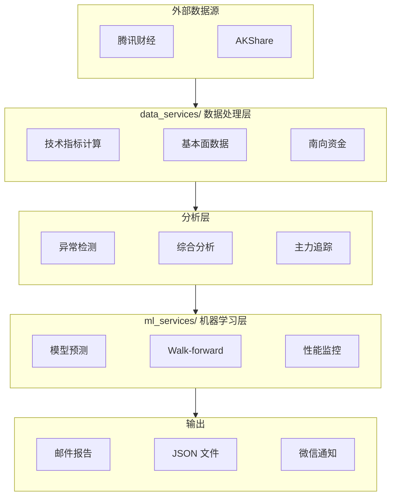

# 系统架构与配置参考

> 2026-10-07 自 [AGENTS.md](../AGENTS.md) 迁出的**参考资料**（Tier 1 拆分）。
> **按需查阅，不随会话加载。** AGENTS.md 只保留带触发条件的指针。

---

## 📐 数据流架构



**关键依赖关系**：
- `comprehensive_analysis.py` 整合：大模型建议 + CatBoost预测 + 异常检测 + 板块分析
- `hsi_prediction.py` 调用 `ml_services/hsi_ml_model.py` 进行CatBoost预测
- `detect_stock_anomalies.py` 使用 `anomaly_detector/` 模块的双层检测（Z-Score + Isolation Forest）
- `config.py` 定义股票板块映射 `STOCK_SECTOR_MAPPING` 和自选股列表 `WATCHLIST`（32只）
- `message_services/` 统一管理邮件和微信通知

**复权口径**（除权除息处理，全链路统一前复权 qfq）：
- 港股：`data_services/tencent_finance.py` 的 `get_hk_stock_data_tencent` 请求 `hkfqkline/...qfq`（前复权）
- A股：`data_services/a_stock_data.py` 的 `get_a_stock_data` 请求 `fqkline/...qfq`（前复权）
- 标签/特征：`Future_Return`、`Label`、`current_price`(entry) 全部基于 qfq 复权价 → 模型学的是除息调整后真实收益
- 股息特征：`ml_trading_model.py` `_add_dividend_features`（7/30天内除净日 + 12月分红次数）
- **Walk-forward 同口径**：`walk_forward_validation.py` 的 `actual_return` 用 `Future_Return`（qfq Close），
  `prediction_analysis.csv` → `backtest_eval.py`/`monthly_guardrail.py` 全部 qfq；实测与腾讯 qfq 复算一致
  （汇丰 2026-03-09 跨除息 20天 +10.03% = +10.03%）
- **性能监控 exit 价必须 qfq 同源**（`fetch_price` 用腾讯 qfq，yfinance 未复权仅兜底）——禁用未复权价当 exit（跨除息日 actual_return 失真，见 lessons 三.17）

**特征模块**（动态构建，自动同步）：
- `data_services/calendar_features.py` - 日历效应（22个特征）
- `data_services/volatility_model.py` - GARCH 波动率（4个特征）
- `data_services/regime_detector.py` - HMM 市场状态检测（10个特征）
- `ml_services/stock_network_analysis.py` - 股票网络分析（社区ID、中心性等）
- `ml_services/hybrid_volatility_model.py` - LSTM-GARCH 混合波动率（3个特征）

**消息服务模块**：
- `message_services/email_sender.py` - 统一邮件发送
- `message_services/wechat_work_bot.py` - 企业微信机器人
- `message_services/wxpusher_bot.py` - WxPusher 推送
- `message_services/notifier.py` - 统一通知接口

**A股核心模块**：
- `a_stock_config.py` - A股配置（股票池53只、板块映射、样本权重）
- `a_stock_ml_model.py` - A股模型训练与预测（1077特征）
- `a_stock_comprehensive_analysis.py` - A股综合分析（买卖建议+异常检测+板块分析）
- `a_stock_email.py` - A股大模型建议生成（通义千问）
- `a_stock_recommendation_generator.py` - 综合买卖建议生成器
- `data_services/a_stock_data.py` - A股数据获取（AKShare+腾讯财经）
- `data_services/a_stock_market_features.py` - A股市场特征（涨跌停、北向资金、跨市场联动）

**数据存储**（`data/` - 机器可读）：
- `data/hsi_models/` - 恒指CatBoost模型（.cbm）和特征配置（.json）
- `data/stock_cache/` - 原始数据缓存（7天有效期）
- `data/feature_cache/` - 特征缓存（7天有效期，170x加速）
- `data/feature_selection/` - 特征选择结果（CSV/TXT）
- `data/hsi_prediction_reports/` - 恒指预测报告（JSON）
- `data/network_features/` - 网络特征（JSON）
- `data/walk_forward_results/` - Walk-forward 验证结果（CSV/JSON）
- `data/hyperparams/` - 超参数记录（JSON）
- `data/analysis_results/` - 分析结果（CSV/JSON）

**A股数据存储**：
- `data/a_stock_models/` - A股CatBoost模型（1d/5d/20d）和特征重要性
- `data/a_stock_cache/` - A股原始数据缓存
- `data/a_stock_feature_cache/` - A股特征缓存
- `data/a_stock_network_features/` - A股网络特征（JSON）
- `data/a_stock_llm_recommendations_*.txt` - 通义千问大模型建议
- `data/a_stock_comprehensive_recommendations_*.txt` - 综合买卖建议

**输出报告**（`output/` - 人类可读）：
- `output/*.md` - Markdown 分析报告
- `output/*.txt` - 文本分析报告
- `output/*.png` - 可视化图表
- `output/*_catboost_20d/` - Walk-forward 验证结果目录
- `output/comprehensive_reports/` - 综合分析报告（知识库材料）

---

## 🏗️ 特征架构（单一真相源）

**核心原则**：特征处理逻辑只在 `ml_trading_model.py` 中维护，其他模块通过导入或方法调用复用。

```
ml_trading_model.py
├── 模块级常量
│   ├── ABSOLUTE_PRICE_FEATURES（40个绝对值特征）
│   ├── NETWORK_FEATURE_MONOTONICITY（7个网络特征单调性）
│   └── MARKET_FEATURE_MONOTONICITY（34个市场特征单调性）
│
├── BaseTradingModel 类
│   ├── get_feature_columns()     # 排除绝对值特征，返回有效特征列表
│   ├── prepare_features_for_selection()  # 特征选择专用方法
│   └── prepare_data()            # 完整特征准备
│
└── FeatureEngineer 类
    ├── 计算技术指标
    ├── 生成交叉特征
    ├── create_monotonic_interaction()  # 智能交叉（保持单调性）
    └── 处理 NaN 和默认值

feature_selection.py
└── model.prepare_features_for_selection()  # 直接调用，无需维护重复逻辑
```

### 绝对价格特征排除列表（40个）

所有绝对值特征都有标准化替代：

| 类别 | 绝对值特征 | 标准化替代 |
|------|-----------|-----------|
| 价格通道 | Channel_High/Low_20d | Channel_High/Low_Ratio_20d |
| 支撑阻力 | Support/Resistance_120d | Support/Resistance_Ratio_120d |
| 均线 | MA5~MA250 | MA_Ratio 系列 |
| 布林带 | BB_upper/lower/middle | BB_Ratio 系列 |
| ATR | ATR, ATR_MA 等 | ATR_Pct, ATR_Ratio |
| 成交额 | Turnover, Turnover_Mean/Std_20 | Turnover_Z_Score |
| 成交量 | Volume_MA7/120/250, Volume_Mean/Std_30d | Volume_Ratio 系列 |
| OBV | OBV, OBV_MA5 | OBV_Trend, OBV_Change_5d |
| VWAP | VWAP | VWAP_Ratio |
| 技术指标 | MACD, MACD_signal, TP | 比率版本 |

### 特征单调性与智能交叉

交叉特征时必须保持逻辑单调性：

| 交叉类型 | 交叉方式 | 示例 |
|---------|---------|------|
| 正向 × 正向 | 乘法 | 中心性 × 收益率 |
| 负向 × 负向 | 风险放大 | 约束度 × VIX → `-|X| × |Y|` |
| 正向 × 负向 | 风险调整 | 中心性 × VIX → `X / (|Y| + ε)` |
| 涉及中性 | 乘法 | × 日历效应 |

**关键**：市场级特征（HSI_Return、VIX 等）对所有股票同值，必须与网络社区特征交叉才能区分个股。

### 新增特征时

只需修改 `ml_trading_model.py`：

```python
# 1. 在特征计算处添加标准化特征
df['New_Ratio'] = df['New_Value'] / df['Close'].shift(1)

# 2. 如果是绝对值，添加到排除列表
ABSOLUTE_PRICE_FEATURES = [..., 'New_Value']

# 3. 如果是市场级特征，添加到 _build_market_level_features()
# 4. 定义单调性（如需要交叉）
```

**feature_selection.py 自动同步，无需修改。**

---

## ⚙️ 环境配置

### 必填环境变量

| 变量名 | 说明 |
|--------|------|
| `SMTP_SERVER` | SMTP 服务器地址 |
| `EMAIL_SENDER` | 发件人邮箱 |
| `EMAIL_PASSWORD` | 邮箱应用密码 |
| `RECIPIENT_EMAIL` | 收件人邮箱列表 |
| `QWEN_API_KEY` | 通义千问 API 密钥 |
| `WECHAT_WORK_WEBHOOK` | 企业微信机器人 Webhook（可选） |
| `WXPUSHER_TOKEN` | WxPusher Token（可选） |
| `WXPUSHER_UIDS` | WxPusher 用户 UID（可选） |

### 主要依赖

`yfinance` `catboost` `akshare` `pandas` `scikit-learn` `lightgbm` `hmmlearn` `arch` `networkx`

---

## 🔄 自动化调度

| 时间 | 工作流 | 功能 | 市场 |
|------|--------|------|------|
| **06:00** (工作日) | `hsi-prediction.yml` | 恒生指数预测 | 🇭🇰 |
| **06:00** (工作日) | `batch-stock-news-fetcher.yml` | 批量个股新闻抓取 | 🇭🇰 |
| 每小时 | `hourly-crypto-monitor.yml` | 加密货币监控 | 🌐 |
| 每小时 | `hourly-gold-monitor.yml` | 黄金监控 | 🌐 |
| **16:00 HKT** (工作日) | `comprehensive-analysis.yml` | 港股综合分析 | 🇭🇰 |
| **00:00 HKT** (工作日) | `performance-monitor.yml` | 性能报告（仅港股，含 lift/方向技能/护栏状态） | 🇭🇰 |
| 周日 09:00 HKT | `weekly-comprehensive-analysis.yml` | 港股周度综合分析 | 🇭🇰 |
| 周日 11:00 CST | `weekly-a-stock-comprehensive-analysis.yml` | A股周度综合分析 | 🇨🇳 |
| 周一 08:00 HKT | `test-llm-api.yml` | LLM API 连通性测试 | - |

> 注：`hourly-stock-monitor`/`stock-anomaly-detection`/`a-stock-comprehensive-analysis`
> （每日15:15）已随 `78421801`/`5026cf0c` 清理，以 `.github/workflows/` 实际文件为准。
