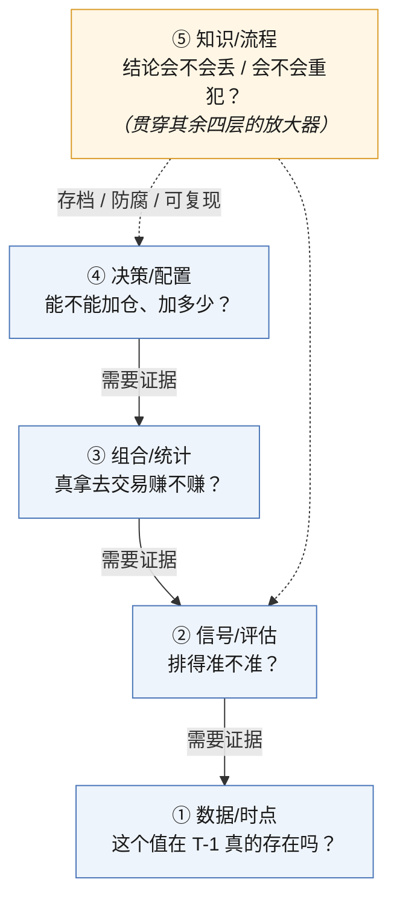
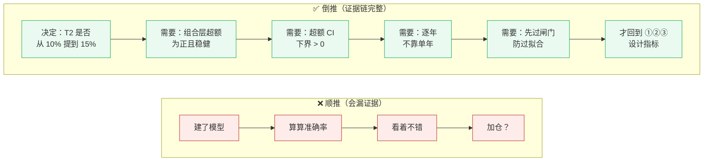
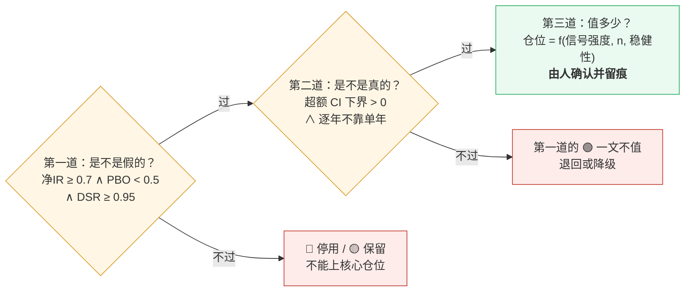
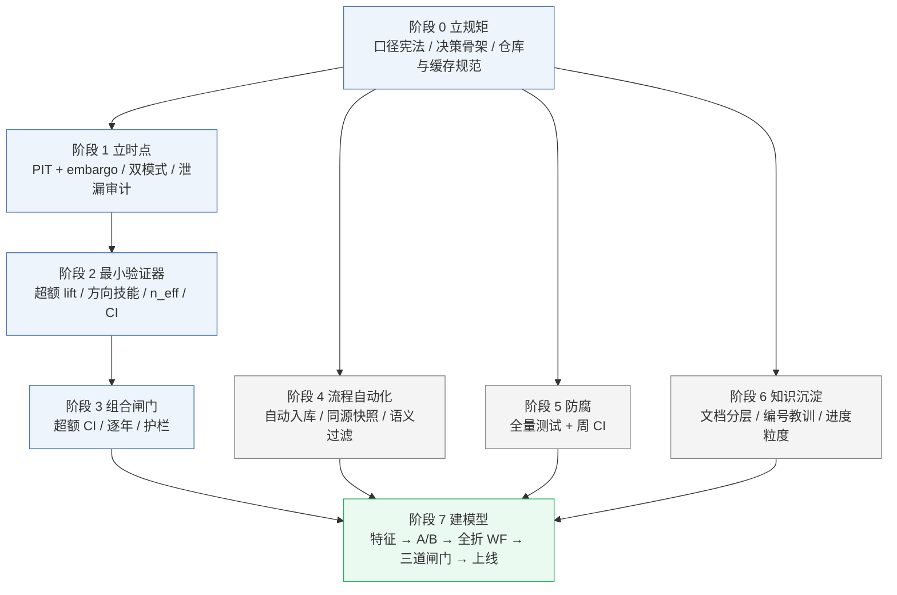
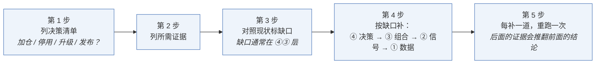
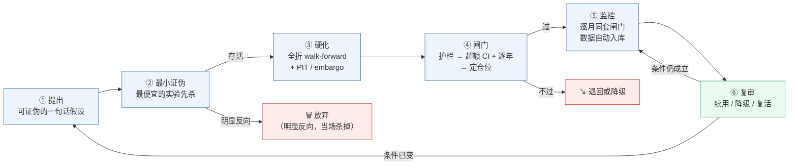

# 量化系统建设方法论

> **定位**：长期方法论手册 —— 回答"**量化系统该怎么建**"。
> 与另外两类文档并列、不重复：
> - [DECISIONS.md](DECISIONS.md) —— 本项目**做了什么决定**、为什么（项目级，会过期）
> - [lessons.md](../lessons.md) —— 本项目**踩过什么坑**（事件级，会累积）
> - **本文** —— 任何量化项目都成立的**建设原则与步骤**（方法级，长期有效）
>
> 实证来源：2026-09 全轮（六周期 [walk-forward](#t-walkforward)、[护栏三关](#t-guardrail)、超额 CI/逐年、D1–D10 决策）。
> 各条原则后的括号内为本项目实证锚点，读时可略过。
> **📖 术语**：文中专业名词（n_eff、PIT、PBO、DSR…）统一在文末 **[§8 术语表](#glossary)** 解释。

---

## ⏱ 一分钟看懂（TL;DR）

**一句话版**：这个系统在回答一个问题——"**一个策略到底能不能用、敢下多大注**"。
它的答案不是"准不准"（那很骗人），而是按**五层**逐层剥：
数据没掺假 → 信号真有本事 → 扣掉成本还赚 → 你才敢下注 → 写进文档免得下次又犯。

**三句话版**：
1. **判断一个策略有三道闸门**：是不是假的（防过拟合）→ 是不是真的（重抽检验 + 逐年）→
   值多少（人来定仓位）。**一道不过，后面的数字全是装饰。**
2. **先立规矩，再建模型**：先花一周把口径、时点、闸门、测试搭好，再做特征调参。
   顺序反了，**每补一道闸门都要全量重跑一次**（每轮约 3 小时）。
3. **可信度 = 最弱一层**：信号再漂亮，数据掺了未来、或没扣成本，结论都是假的。

### 贯穿全文的主线案例：20d 这个策略，到底能不能加仓？

后面的章节会反复用这个故事举例。

**背景**：个股 20d 行业中性 TopK 策略，walk-forward 显示"准确率 51.8%"。
但**准确率高不等于能赚**——要一层层剥：

| 层 | 要问的问题 | 20d 策略的答案 |
|---|---|---|
| ① 数据 | 回测用的数据，在 T-1 时真的能拿到吗？ | ✅ PIT / 隔离排查通过 |
| ② 信号 | 51.8% 比"永远看涨"的 49.5% 高多少？ | ⚠️ 超额 lift 只有 **+1.9pp**，不显著 |
| ③ 组合 | 扣掉 0.5% 换手成本、按行业配平，还赚吗？ | ✅ 净IR **1.41**，合格 |
| ④ 决策 | 三道闸门全过吗？ | ✅ 过！但 lift 弱 → **只敢加到 15%，不敢 20%** |
| ⑤ 知识 | 结论记进账本了吗？ | ✅ 写进 DECISIONS，留"待人工确认"，下月复核 |

一句话记住这个故事：**统计说"过关"（事实），人来定"15%"（决策），理由是 lift 太弱。**

### 三条阅读路径（按你的身份走）

| 你是谁 | 读什么 | 可跳过 |
|---|---|---|
| **只想判断"我有个信号能不能用"** | §2 原则6（三道闸门）+ §7 自检清单 + §8 术语表查词 | §3 建设步骤、§4 生命周期 |
| **想从零建一个量化系统** | §3 七阶段建设步骤（带 checklist）+ §4 生命周期 | 领会"三道闸门"即可进 §3 |
| **想彻底搞懂为什么这么设计** | 全读，顺序：TL;DR 主线 → 每章开头的引言 → 细节 → 术语表 | 无 |

> **阅读提示**：下文每章开头都先用 20d 的故事讲一句关键理解，读懂了就能跳过细节。

---

## 0. 总纲

> 50.9% 的模型可能亏钱、49.6% 的模型可能赚钱——差的往往不是模型，而是下面这些门槛。

> **量化系统 = 在不骗自己的前提下，把"我猜"变成"我敢下多少注"的完整证据链。**
>
> 链条上任何一环缺失，后面的数字都只是装饰；而链条本身，比任何一个环节都值钱。
>
> **量化系统的可信度 = 最弱一层的可信度。** 信号层再花哨，组合层没扣成本就是纸面富贵；
> 组合层再严谨，决策层没做逐年就是赌博。

两条推论，贯穿全文：

1. **从决策倒推，不从模型顺推。** 先明确"我最终要做什么决定"，再问"这个决定需要哪些证据"，
   最后才设计指标与实验。顺推永远会漏证据——因为漏掉的恰好是没人想到要问的问题。
2. **先算独立样本，再算任何指标。** 不先算 [n_eff](#t-neff)，所有 [p 值](#t-pvalue)、[CI](#t-ci)、Sharpe 都是虚的。

---

## 1. 五层结构

> 用 20d 的例子开场：判断一个策略像剥洋葱——数据有没有掺假 → 信号有没有真本事 →
> 扣掉成本还赚不赚 → 敢下多大注 → 记没记进账本。那个"51.8%"就是一层层剥到今天的"15% 仓位"的。

| 层 | 回答的问题 | 核心指标 | 这一层的典型死法 |
|---|---|---|---|
| **① 数据/时点** | 这个值在 T-1 真的存在吗？ | [PIT](#t-pit) 还原、[embargo](#t-embargo)、[`shift(1)`](#t-shift)、缓存失效 | 静态快照广播穿越（"最新值"铺到全部历史行） |
| **② 信号/评估** | 排得准不准？ | **[超额 lift](#t-lift)、[方向技能](#t-skill)、[ICIR](#t-icir)、[n_eff](#t-neff)** | 用绝对准确率自我感动；基准各写各的 |
| **③ 组合/统计** | 真拿去交易赚不赚？ | 扣成本 [净IR](#t-netir)、[block bootstrap](#t-blockboot)、**[PBO](#t-pbo)**、**[DSR](#t-dsr)** | [重叠样本](#t-overlap)虚高；只报最优配置不报校正 |
| **④ 决策/配置** | 能不能加仓、加多少？ | 闸门三问（见 §2 原则 6） | 把"统计过关"直接读成"可以满仓" |
| **⑤ 知识/流程** | 结论会不会丢/会不会重犯？ | 决策备忘、可复现路径、CI 执行点 | 结论散落；测试静默腐烂；[口径](#t-caliber)改了不洗历史 |



**结构要点**：
- 五层**缺一不可**，且**层与层之间会脱节**（护栏过了却答不了"能否加仓"，就是④和③脱节的现场）。
- 每层有自己的指标体系，**上层指标不能替代下层指标**（信号层 IC 不能替代组合层超额）。
- **⑤ 是放大器**：没有它，前四层每次都会重犯；有了它，前四层的成本被摊薄。

---

## 2. 七条元原则

> 七条全是"防被骗"。最骗人的三条：① 绝对准确率（牛市里乱猜都对）；
> ② 只看整体不看年份（可能全靠某一个大涨年撑起来）；③ 把"统计过关"当"可以满仓"
>（其实弱信号只配 15%）。

### 原则 1：基准比模型更难定义，也更决定结论

同一批数据，换一个基准就换一个世界（本项目三周期模式）：

| 基准 | 结论 |
|---|---|
| 随机 50% | 「111 看涨 67.9%，是信号！」 |
| **同向 20d 基准**（60.3%/57.8%） | 「净贡献 0~+7.6pp，Bonferroni 后全部不显著」 |
| **等权组合基准** | 「绝对净IR 1.41 很好」→「超额 1.24 才是真本事」 |

**基准选择本身就是最强的假设。** 它应与口径一起"立宪"，且必须**显式写出**
（"相对于什么的超额"），否则每份报告各写各的，结论永远不可比。

> **做法**：任何评估报告开头固定三行 —— `指标定义 / 基准 / 样本区间`。缺一行，报告作废。

### 原则 2：从决策倒推证据链



> 顺推漏掉的那条指标，恰好是**没人想到要问的问题**——所以证据链必须从决策倒推。

### 原则 3：独立样本先于任何指标（n_eff 是第一道算术题）

20 天持有期的 1000 条预测，**独立信息 ≈ 1000/20 = 50 条**。

**铁律顺序**：
1. 先算 **n_eff**（重叠修正后的独立样本数）
2. `n_eff < 30` → 结论一律标"样本不足"，**禁止写进 AGENTS/README**
3. 然后才轮到准确率 / IR
4. 置信区间用 **block bootstrap**（按期重抽），不是 iid bootstrap

> 反例（本项目恒指）：51.3% / 54.8% / 59.1% 三个数字，先算 n_eff（≈143/35）就会直接标不显著，
> 不会有人拿去当卖点。

### 原则 4：负结果必须制度化，否则等于没做

一个负结果不写下来，两周后会被重做一次；重做一次成本 3 天，写下一行成本 5 分钟。

**制度化 = 三件套**：

| 要素 | 内容 | 反例 |
|---|---|---|
| 决策 | 「不做什么」 | 只写"本次未通过" |
| 证据 | 关键数字（如 DSR 0.87、IC 转负） | 只写"效果不好" |
| **重启条件** | 「更大池 × 更长历史 × 重过闸门才复议」 | 永久封死（错过复活的路） |

> **否定权比肯定权值钱。** 量化团队的资产不只是信号库，还有**禁区库**——
> 一份"已验证不可行"的清单能省下未来一半研究时间。

<a id="p5"></a>

### 原则 5：口径即宪法 —— 改口径 = 立宪 + 全库清洗 + 可复现审计

改评估[口径](#t-caliber)（如"[绝对准确率](#t-acc)"改为违宪指标）会连锁失效历史数字。

**三步缺一不可**：
1. **立宪**：新口径写进决策文档，旧口径标注"违宪"
2. **清洗**：当天 `grep` 全库找旧数字，逐处改或标废弃
3. **审计**：每个对外数值必须**能从现存入库数据复现**（复现不了 = 不许写）

> 反例：改口径未清洗 → 885≠697（旧表样本数对不上）、eval 报告指向已废弃 CSV，整份文档返工。
> 附带铁律：**准确率必须相对基准读**——"67.9%" 不带基准就是自我欺骗。

<a id="p6"></a>

### 原则 6：统计过关 ≠ 可交易；闸门是淘汰赛，不是颁奖

必须区分三个不同问题，用三道不同闸门：

| 问题 | 闸门 | 判定 |
|---|---|---|
| **是不是假的？**（必要条件） | 净IR ≥ 0.7 且 PBO < 0.5 且 DSR ≥ 0.95 | 任一不过 → 不能上核心仓位 |
| **是不是真的？**（充分性） | **超额 bootstrap CI 下界 > 0** + **逐年不靠单年** | 只过 CI → 可能全靠某一年；只过逐年 → 可能赚太少只是运气 |
| **值多少？**（幅度） | 信号强度 × 样本量 × 稳健性 → 仓位 | 这是**风险预算决策，不是统计决策** |



**最危险的滑坡**：把第一道的 🟢 直接读成第三道的"可以满仓"。
**第二道不过，第一道的 🟢 一文不值**（过拟合的策略天然能过绝对指标）。

> 三个坑（本项目 2026-09-26 实测）：
> 1. CI 必须用**超额口径**（TopK净 − 等权基准）。基准自身 CI 常跨 0（实测 0.97 [−0.16, 2.04]），
>    只看绝对 IR 会高估。
> 2. **DSR 本身就是选择后校正**（`deflated_sharpe(sr[best], T, N=配置族数)`），
>    拿最优配置去算 DSR 是标准用法——**不要再要求"改用先验口径复核"，那是重复扣水**。
>    错误的谨慎比错误的激进更危险，因为它听起来更专业、没人质疑。
> 3. 逐年样本很小（每年仅 7~12 期），单年 IR 不可外推，**看符号一致性而非大小**。

### 原则 7：结论必须条件化 —— 没有"全面更优"这回事

- 某学习器 20d 赢、**5d 上对手六项全占优**、1d 两者双停 → "全转 A" 是伪命题
- 抄底信号显著，但逐年依赖反弹年、仅限特定 regime 才有效
- 板块胜率 70% 是短窗未 embargo 的实时统计，与全期结论矛盾

**结论的正确写法永远是**：

```
[什么信号] 在 [什么周期/什么池/什么 regime] 下，
以 [什么学习器/什么参数] 得到 [什么效应]，
以 [什么基准] 度量，样本 [多少]，[显著/不显著]
```

**缺任何一个括号的结论，都不该进 AGENTS。**
一刀切（全转 / 全停 / 全升）是条件化不足的外在症状。

---

## 3. 建设步骤

> 先花一周立骨架（口径、时点、闸门、测试），再开始做模型。顺序反了就得返工——
> 我们自己就是先建模型、后补闸门，每补一道重跑一次全量（约 3 小时）。
> **骨架先立好，后面全是省时间。**

### 3.1 总路线图：七个阶段

**顺序铁律：阶段 0→7 不可颠倒；4/5/6 可部分并行；阶段 7（建模型）必须最后。**

| 阶段 | 名称 | 目标 | 交付物 | 工作量 |
|---|---|---|---|---|
| **0** | 立规矩 | 定义"什么算证据" | 口径宪法、决策文档骨架、提交/缓存规范 | 1 天 |
| **1** | 立时点 | 保证"证据不含未来" | PIT/embargo 回测骨架、双模式、泄漏审计清单 | 2–3 天 |
| **2** | 最小验证器 | 能正确地"读"信号 | `backtest_eval`（lift/方向技能/n_eff）、报告模板 | 1 天 |
| **3** | 组合闸门 | 能回答"值不值钱" | `portfolio_backtest`（超额 CI/逐年）、`monthly_guardrail` | 2 天 |
| **4** | 流程自动化 | 证据链不断、不陈旧 | 自动入库、同源快照、语义过滤、缓存失效 | 0.5–1 天 |
| **5** | 防腐 | 系统不静默腐烂 | 全量测试 + 周 CI + 提交前跑测试 | 0.5 天 |
| **6** | 知识沉淀 | 结论不丢、不重犯 | 文档分层地图、编号教训、进度粒度 | 0.5 天 |
| **7** | 建模型 | 真正开始研究 | 特征 → 学习器 A/B → 全折 WF → 闸门 → 仓位 | 无限 |

> **总计约 7–9 天的"骨架期"，才轮到第一行特征工程。**
> 跳过骨架期直接做阶段 7，是几乎所有量化项目的默认开局，也是所有返工的源头。

### 3.2 各阶段详细说明（含验收 DoD 与跳步代价）

#### 阶段 0 · 立规矩（1 天）

**做什么**
- [ ] 建 `DECISIONS.md`：一条决策一行，含**决策 / 证据 / 重启条件**
- [ ] 写**评估口径宪法**：指标定义、**基准**、n_eff 规则、**违宪指标清单**（如绝对准确率）
- [ ] 定仓库规范：哪些文件入库（`.md`/`.py` 必入，`.csv`/`.pkl` 视规则）
- [ ] 定缓存规范：改特征/改数据必须 `rm -rf data/*_cache/*.pkl`
- [ ] 定报告模板：`指标定义 / 基准 / 样本区间` 三行指纹置顶

**验收 [DoD](#t-dod)**
- 任选一个指标，能说出"定义 / 相对什么 / 错误读法"三件事
- 违宪指标已列成清单，全库有 grep 手段

**跳步代价**：口径打架 → 后续所有历史数字不可比，改一次口径洗一次库（本项目 30+ 处作废）。

#### 阶段 1 · 立时点（2–3 天）

**做什么**
- [ ] 回测骨架强制 **PIT + embargo**：训练窗截止于 T-k，特征截止于 T-1
- [ ] 双模式分离：`production`（当日数据，收市后预测）/ `backtest`（T-1 数据，walk-forward）
- [ ] **特征泄漏审计**：逐特征问"这个值在 T-1 收盘时真的存在吗？"
  - 高危类别：网络/情感/主题/基本面的**静态快照广播**（最新值铺到全部历史行）
  - 机械规则：一切 `.rolling()`、`.shift()`、未来收益标签走检查表
- [ ] 未来收益标签用 `returns.shift(-N)`，与训练口径一致

**验收 DoD**
- 抽 10 个特征做时点口试，全部能答出"数据在 T-1 的可得性"
- 首轮回测准确率落在"合理区间"（本项目经验：个股日线 50–60%；
  **>65% 通常是泄漏信号**，恒指因序列性强可略高）

**跳步代价**：整条证据链作废——**这一层错了，后面六层全部白做**，且很难自我发现。

#### 阶段 2 · 最小验证器（1 天）

**做什么**
- [ ] 实现 `backtest_eval`：**超额 lift、方向技能、n_eff、block bootstrap CI**
- [ ] 同时输出 IC/ICIR（用实际收益率，非二元标签）
- [ ] 报告自动带三行指纹 + 复现命令（指向具体入库 CSV）

**验收 DoD**
- 报告能回答"相对什么的超额"，且数字可从入库数据一键复现
- n_eff 自动计算，低于 30 自动打标

**跳步代价**：只能报绝对准确率 → 原则 1、3 全部失效，自我感动式结论进入文档。

#### 阶段 3 · 组合闸门（2 天）

**做什么**
- [ ] `portfolio_backtest`：行业中性 TopK、扣成本、**超额 bootstrap CI**（相对等权基准）、**逐年分解**
- [ ] `monthly_guardrail`：净IR / **PBO**（CSCV）/ **DSR**（计入配置族数）+ 判定 🟢/🟡/🔴
- [ ] 把三道闸门**按顺序固化进 SOP**（见 §3.3）

**验收 DoD**
- 三个问题能被**分开**回答：是不是假的 / 是不是真的 / 值多少
- 闸门命令一条不落地跑通，输出 md 报告

**跳步代价**：信号层过关、组合层裸奔——"研究上很准，实盘上亏钱"的标准剧本。

#### 阶段 4 · 流程自动化（0.5–1 天）

**做什么**
- [ ] 回测成功后**自动入库**产物 CSV + 同步门槛快照（保证 CI 与本地同源）
- [ ] 监控/报告取文件**按语义过滤**（不按 mtime 抢占），防"1d 报告抢 20d 状态"
- [ ] 数据源：重试 + 备用源 + 缓存兜底
- [ ] 删除旧文件时保留链路（清理脚本同步更新）

**验收 DoD**
- CI 与本地跑同一门槛，**数值完全一致**
- 断网/坏源场景下系统不崩（降级到缓存）

**跳步代价**：数据静默陈旧、门槛不同源、误报（本项目 mtime 抢占导致误判"停用"）。

#### 阶段 5 · 防腐（0.5 天）

**做什么**
- [ ] 全量单元测试 + **每周固定 CI 执行点**（无执行点的测试必然腐烂）
- [ ] 提交前本地跑测试形成肌肉记忆
- [ ] 测试三类失败分开处理：过时断言 / "时间旅行"断言 / **时区真 bug**

**验收 DoD**
- 故意改坏一处，**一周内必被发现**（而不是 5 个月）

**跳步代价**：测试静默腐烂，你以为有防护，其实没有（本项目 3 个测试失败挂了 5 个月）。

#### 阶段 6 · 知识沉淀（0.5 天）

**做什么**
- [ ] 文档分层建全，并在入口处给"**该看哪份**"的地图：
  | 文档 | 回答 | 性质 |
  |---|---|---|
  | `AGENTS.md` | 规则与常用命令 | 入口 |
  | `DECISIONS.md` | 做了什么决定、为什么 | 项目级，会过期 |
  | `lessons.md` | 踩过什么坑 | 事件级，会累积 |
  | **本文** | 系统该怎么建 | 方法级，长期有效 |
  | `VALIDATION_GUIDE.md` | 怎么验 | 操作手册 |
  | `progress.txt` | 逐日流水 | 过程记录 |
- [ ] `lessons.md` 用**编号 + 版本日志**，每条含"经过 / 教训 / 做法"
- [ ] 定"**文档增速 ≤ 检索能力**"的收敛规则（月度压缩流水）

**验收 DoD**
- 新会话 / 新人 10 分钟内能定位"我要做 X，该看哪份文档"

**跳步代价**：写入越多检索越难，知识变成负债（本项目 progress 已 2000 行、lessons 900 行）。

#### 阶段 7 · 才开始建模型（无限）

**做什么**（每一步都挂在阶段 0–6 的骨架上）
- [ ] 特征工程（先绝对值标准化、市场级特征交叉、单调性检查，再谈新增）
- [ ] 学习器 **[A/B](#t-ab) 按周期/按域分别做**，禁止一刀切（原则 7）
- [ ] 全折 walk-forward（PIT 口径）
- [ ] **三道闸门**依次过：护栏 → 超额 CI + 逐年 → 仓位定档
- [ ] 进监控，按月复核，到期复审

**跳步代价**：无（这一步本来就不该在前面）。

### 3.3 阶段依赖关系



> 阶段 2/3 的输出必须**能被 4 保存、被 5 保护、被 6 记录**——这就是三条支线挂在阶段 0 的原因。

**两个不可逆点**：
1. **阶段 1 跳过 = 结论不可信**（但自己看不出来）
2. **阶段 0/2 之后改口径 = 全库清洗 + 全量重跑**（每次约 3 小时起）

### 3.4 存量系统怎么补（不从零开始时的顺序）

真实项目多半**顺序是反的**（先建了模型，后来才发现缺闸门）。补课不能从头排队，
**按"离决策层最近的缺口优先"补**：



| 第 N 步 | 要回答的问题 |
|---|---|
| 1 | 我要做的决定有哪些？（加仓？停用？升级？发布？） |
| 2 | 每个决定需要哪些证据？ |
| 3 | 现状已有 / 缺失什么？（缺口通常在 ④③ 层） |
| 4 | 按缺口补，**优先补最靠近决策层的（④ → ③ → ② → ①）** |
| 5 | 每补一道，重跑一次——成本必然发生 |

> **为什么从④往①补**：越靠近决策层的缺口影响越大、发现越晚。
> 本项目补课现场：护栏过了却答不了"能否加仓"→ 补超额 CI → CI 过了才发现没看逐年
> ——**每补一道就重跑一次全量 walk-forward（约 3 小时）**。
> **闸门前移 1 天，可省后补 3 轮。**

**补课的正确心态**：补课期间的旧结论一律标"待重验"，不要边补边引用。

---

## 4. 一个量化假设的生命周期

> 一个想法从"好像有用"到"能下单"，要走六步，任何一步不过就淘汰。
> 最值钱的是第 2 步——用最便宜的实验先杀掉明显伪信号，省下未来 3 天。



> ⑤→⑥→⑤ 的回环与 ⑥→① 的重启，是这套流程**不会僵死**的关键：结论不是终点，是待复审的假设。

| 阶段 | 关键动作 | 通过标准 | 常见偷懒 |
|---|---|---|---|
| ① 提出 | 写成**可证伪**形式："X 在 Y 条件下应产生 Z" | 能说出"什么结果算我错" | 写成"我觉得可能有用"（不可证伪） |
| ② 最小证伪 | 用**最便宜**的实验先杀 | 明显反向 → 当场放弃 | 一上来就跑全折 3 小时 |
| ③ 硬化 | 全折 walk-forward + PIT/embargo | lift/方向技能显著 | 只看准确率 |
| ④ 闸门 | 护栏 → 超额 CI + 逐年 → 定仓位 | 见原则 6 | 过了第一道就宣布成功 |
| ⑤ 监控 | 每月跑同一套闸门，**数据源自动入库** | 数据同源、语义正确 | 人工传文件 → 静默陈旧 / mtime 抢占 |
| ⑥ 复审 | 按日期回看条件是否变了 | 续用 / 降级 / 复活 | 永久封死或永久躺赢 |

> **复审规则**：重大决策（尤其是"停止某方向"）必须写**复审日期 + 复活条件**。
> 否则"永久停"会变成"永远错过的路"。

---

## 5. 反模式清单（出现即停手）

> 这些坑我们都踩过，记成黑名单了。哪条看着眼熟，先停下手中的活——你大概正在重复踩。

### ① 数据层
- 静态快照（最新值）广播到全部历史行
- 训练 / 回测共用同一份缓存
- 新增特征不清缓存

### ② 信号层
- 拿**绝对准确率 / 胜率**对外表述
- 二元标签算 IC（必须用实际收益率）
- 方向判断阈值不是 0.5（本项目定为 0.5，高置信度另说）
- 跨股票训练用绝对价格/成交量特征（必须标准化或排除）
- 报告不写基准

### ③ 组合层
- 重叠样本当独立样本报 p 值
- 报最优配置的点估计、**不报 DSR**
- 只报绝对 IR、不报相对基准的**超额**
- 忽略换手与成本敏感性

### ④ 决策层
- 🟢 直接当满仓指令
- 用"统计显著"替代"仓位合理"
- 决策不写重启条件 → 永久封死
- **给不过关的策略加"谨慎保留意见"式降温**
  （听上去专业，实则误导——本项目 DSR 误读差点把 🟢 判回 🟡）

### ⑤ 知识层
- 结论只留在报告、不进决策文档
- 改口径不洗历史文档
- 无 CI 执行点的测试（必然腐烂）
- 文档增速 > 检索能力

---

## 6. 人机边界：统计管什么、人管什么

> 统计负责筛掉骗子，你负责决定下多大注。统计说"不显著"，你不能改口说"其实显著"——
> 只能降仓或不用；统计说"过关"，你还得定 15% 还是 20%。

| 交给统计（硬规则，不可商量） | 交给判断（人来做，写明理由） |
|---|---|
| 口径与基准的定义执行 | **选哪个基准**（但定了就立宪） |
| 显著性、CI、PBO、DSR | **升配幅度**（15% vs 20% 是风险预算，不是统计问题） |
| 闸门通过 / 不通过 | 是否为"边缘但有意义"的信号破例（须记录在案） |
| 逐年 / 分域的符号一致性 | regime 判断（如"仅大盘上行期"这类规则的取舍） |
| 重启条件是否满足 | 何时复审、何时彻底关闭 |

**核心分界线：统计负责"排除"，判断负责"选择"。**

- 统计说"不显著" → 判断**不能**推翻它说"那就是显著"，
  只能说"我接受不显著并降仓"或"我拒绝部署"。
- 统计说"显著" → 判断**仍要**决定仓位、上限、是否实盘。

> 正确样本（本项目 2026-09-26）：
> **统计说三关全过（事实）→ 判断定 15% 而非 20%（决策）→ 记录写明"待人工确认"（留痕）。**

---

## 7. 上线前自检清单

> 上线前对这张表打勾，缺一项就不要发。打勾三分钟，缺了可能亏三个月。

**证据链完整性**
- [ ] n_eff 已算，< 30 已标"样本不足"
- [ ] 每个数字带三行指纹（指标定义 / 基准 / 样本区间）
- [ ] 每个数字可从**现存入库数据**一键复现
- [ ] 特征逐个过时点口试（T-1 可得性）

**三道闸门**
- [ ] 护栏：净IR ≥ 0.7 ∧ PBO < 0.5 ∧ DSR ≥ 0.95
- [ ] 充分性：**超额** CI 下界 > 0 ∧ 逐年无单年独撑
- [ ] 幅度：仓位 = f(信号强度, n, 稳健性)，并由**人**确认、留痕

**结论表述**
- [ ] 结论带全六个括号（信号/域/学习器/效应/基准/样本与显著性）
- [ ] 没有"全面更优 / 全部停用"式一刀切
- [ ] 负结果已进 `DECISIONS.md`（含重启条件）
- [ ] 重大决策已写复审日期

**系统防腐**
- [ ] 回测产物自动入库、门槛数据 CI/本地同源
- [ ] 文件读取按语义过滤（非 mtime）
- [ ] 测试有每周 CI 执行点，提交前本地已跑
- [ ] 文档入口有"该看哪份"的地图

---

<a id="glossary"></a>

## 8. 术语表

> 这是查字典的地方——正文里遇到不懂的词，大多是这 37 条之一。

> 本表解释**本文出现过的所有专业名词**，按层分组。每条给"白话解释 + 为什么重要"。
> 正文首次出现处可点击跳转。未收录的词欢迎补进本表（新增文档术语时同步更新）。

### 8.1 时点与数据（对应 §1 第①层）

<a id="t-pit"></a>
**PIT（Point-in-Time，时点数据）**
任何数据只允许使用"**当时已经公开的版本**"。例：财报在 5 月 15 日才发布，那么 5 月 14 日的
预测就不许用这份财报——哪怕你现在手上是"最新值"。
> 为什么重要：用了未来才有的信息，回测准确率会虚高到不真实，且**自己很难发现**。

<a id="t-leak"></a>
**数据泄漏 / 特征穿越（data leakage）**
特征里混进了"预测时点之后"的信息。常见形态：算收益时没 `shift`、标签串进特征、
训练集里包含了测试区间。
> 为什么重要：这是量化回测**第一号杀手**——它会让所有后续指标（准确率/IR/CI）全部失去意义。

<a id="t-shift"></a>
**`shift(1)` / `shift(-N)`**
`shift(1)` = 取**前一天**的值（防泄漏的标准动作）；`shift(-N)` = 取**未来 N 天**的值
（只允许用于"计算未来收益"这种标签，且算完即存标签，不再当特征用）。
> 一句话：**特征往后挪，标签往前看，两者不许串门。**

<a id="t-embargo"></a>
**embargo（隔离期/隔离带）**
在训练区间和测试区间之间**留一段空白**（至少等于持有期），防止"训练末期快到期的持仓信息"
渗透进测试。
> 为什么重要：20 天持有期若不留隔离，训练集最后一天的仓位信息会以"收益重叠"的方式泄进测试。

<a id="t-snapshot"></a>
**静态快照广播（broadcast of a latest snapshot）**
把"某天的最新值"（网络社区、情感分数、主题热度、基本面快照）**复制铺到全部历史行**。
> 为什么重要：这是**最隐蔽的一种泄漏**——单看每个特征都正常，只有整体准确率"高得离谱"才暴露；
> 本项目因此要求网络/情感/基本面类特征必须按日期存历史版本（PIT 还原）。

<a id="t-dualmode"></a>
**双模式（production / backtest）**
同一套代码两种数据口径：`production` = 用**当日**数据做收市后预测；
`backtest` = 用 **T-1** 数据模拟当时能拿到的输入。
> 为什么重要：两种模式混用，回测和实盘就永远对不上。

### 8.2 评估指标（对应 §1 第②层）

<a id="t-acc"></a>
**绝对准确率 / 绝对胜率**
"预测对了多少个百分点"，**不减任何基准**。
> 为什么重要：在单边上涨的市场里"永远看涨"也能拿 60%——所以本项目把它列为**违宪指标**
>（见 [原则 5](#t-constitution)），只许看下面的"超额"类指标。

<a id="t-lift"></a>
**超额 lift**
`信号胜率 − 无条件买入基准胜率`。即"模型挑出来的票，比闭眼全买强多少"。
> 为什么重要：它把**行情的功劳**从**模型的功劳**里扣掉。本项目个股 20d 实测 lift 仅 +1.9pp
> （p=0.24 不显著）——这就是"统计过关但只值 15% 仓位"的核心原因。

<a id="t-skill"></a>
**方向技能（directional skill）**
`模型准确率 − 永远看涨的准确率`。回答"你是不是只是在蹭牛市"。
> 为什么重要：与超额 lift 互补——一个从胜率角度、一个从"最笨基线"角度证伪自我感动。

<a id="t-ic"></a>
**IC / Rank IC（信息系数）**
分数与未来收益的**相关系数**。Rank IC 用秩相关（对异常值更稳）。
> 判读：0.02–0.06 属正常水平；**必须用实际收益率算，不能用二元涨跌标签**。

<a id="t-icir"></a>
**ICIR**
`IC 均值 / IC 标准差`，衡量信号**稳不稳**（不是强不强）。
> 判读：> 0.3 较好。IC 高但 ICIR 低 = 时灵时不灵。

<a id="t-netir"></a>
**净IR（净信息比率/净夏普）**
`扣交易成本后的收益均值 ÷ 收益标准差`，再按持有期年化。
> 为什么重要：这是**组合层的总分**——信号再准，换手太贵、回撤太大都会把它拖下来。
> 本项目门槛：≥ 0.7 才够升级资格。

<a id="t-pvalue"></a>
**p 值 / 显著性**
假设"**其实没有效果**"时，观察到当前或更极端结果的概率。p < 0.05 通常叫"显著"。
> 陷阱：p 值受**样本量**支配——样本不足时效应再大也不显著（恒指 59.1% p=0.36 就是此理）。

<a id="t-ci"></a>
**置信区间 CI（confidence interval）**
"真实值大概落在哪个范围"。**CI 跨过 0 = 不显著**（可能正可能负）。
> 本项目标准：下界 > 0 才算过——"连最差的一批重抽结果都为正"。

<a id="t-bonf"></a>
**Bonferroni 校正**
同时检验 N 个假设时，把显著性门槛除以 N（α/N）。
> 为什么重要：试 8 个模式总有 1 个"碰巧显著"——不校正就是自欺。本项目 8 模式用 α=0.00625。

### 8.3 样本与统计方法（对应 §1 第③层）

<a id="t-neff"></a>
**n_eff（有效独立样本数）**
**真正互相独立的观测条数**。持有期 20 天时，相邻预测的收益区间高度重叠：
1000 条预测的独立信息大约只有 `1000 ÷ 20 ≈ 50` 条。
> **这是第一道算术题**：p 值、CI、显著性一律按 n_eff 算，不按行数算。
> 判读：**n_eff < 30 → 结论一律标"样本不足"**，禁止写进 AGENTS/README。

<a id="t-overlap"></a>
**重叠样本（overlapping samples）**
持有期 > 1 天时，第 t 天和第 t+1 天的信号赚的是同一段行情——行数变多，信息没变多。
> 为什么重要：不处理会**虚报显著性**（把重复计数当证据）。

<a id="t-blockboot"></a>
**block bootstrap（块自助法）**
重抽样时**整段整段地抽**（例如每次抽连续 20 天的一块），而不是逐行抽，从而保留时间序列的
自相关结构。本项目用来算**超额IR 的 95% CI**。
> 对照：普通 bootstrap 逐行打乱 → 会低估不确定性 → CI 假性变窄。

<a id="t-walkforward"></a>
**walk-forward（滚动前进验证）**
窗口向前滚动：用过去一段训练 → 预测下一段 → 窗口前移 → 再训练再预测……
**任何时点的模型都只用"当时已有"的数据**。
> 为什么重要：它是唯一贴近真实交易的验证方式；单次随机切分（train/test split）
> 会把未来信息混进训练。

<a id="t-pbo"></a>
**PBO（回测过拟合概率，Probability of Backtest Overfitting）**
用 **CSCV 法**（把历史切成多段、交叉验证式地比较"在好段挑的配置拿到差段还行不行"）估计
**"你选中的最好配置其实只是运气"的概率**。
> 判读：< 0.5 及格，< 0.25 强证据。它专治"我试了 20 个参数，挑了最好的那个"。

<a id="t-dsr"></a>
**DSR（Deflated Sharpe Ratio，收缩/折让后夏普）**
回答"**我试了 N 个配置、挑了最好的那个，这个 Sharpe 还可信吗**"——把试验次数折算进显著性。
> **关键读法**：`deflated_sharpe(sr[best], T, N=配置族数)` 拿最优配置去算，**就是标准用法**
> （N 已经扣过水）。再要求"改用先验口径复核"属于**重复扣水**——本项目差点因此把 🟢 误判成 🟡。
> 判读：≥ 0.95 才算过。

<a id="t-config"></a>
**配置族（config family）**
一次评估里**真正互相竞争的候选配置集合**（本项目护栏用 `topk∈{5,10,20} × 中性∈{是,否}`
= 6 个配置族）。DSR 的试验次数 N 就取这个数。

### 8.4 组合与交易（对应 §1 第③④层）

<a id="t-topk"></a>
**TopK**
按模型分数**排名取前 K 只**等权持有（本项目 T2 用 TopK=10）。

<a id="t-neutral"></a>
**行业中性（sector neutral）**
**在每个行业内部**各自排名选股，再按行业权重配平。
> 为什么重要：否则模型可能"前 10 名全是同一种行业"——赚的是行业 beta，不是选股 alpha，
> 且单行业暴露会放大回撤。

<a id="t-cost"></a>
**换手 / 成本敏感性**
每次调仓买卖的比例，以及按费率（本项目按 0.5%）扣掉的成本。
> 为什么重要：**信号微弱时成本能吃掉全部 edge**——所有组合层指标必须是"净"的。

<a id="t-metalabel"></a>
**元标签（meta-labeling）**
两层模型：第一层判断**方向**（买不买），第二层判断"**这一笔会不会赢**"，
输出的校准概率用于决定仓位（Kelly）或过滤。
> 本项目结论：**用于 Kelly 仓位（须 Isotonic 校准）有效，用于硬过滤无效**（见 DECISIONS D6）。

<a id="t-regime"></a>
**regime（市场状态/行情环境）**
行情所处的**环境分类**，如趋势上行、熊市、震荡、极端恐慌。
> 为什么重要：很多信号是**条件成立**的——本项目抄底信号显著但"仅限大盘上行期（恒指 > MA200）"，
> 换个 regime 就不成立。

<a id="t-learner"></a>
**学习器（learner）**
底层算法本身（CatBoost、LightGBM 等），区别于特征与参数。
> 本项目结论（DECISIONS D10）：**学习器优劣是"分周期"属性**，禁止一刀切全转。

<a id="t-ab"></a>
**A/B（同折对照）**
两个候选在**完全相同的折、参数、数据**下只换一个变量跑对比。
> 为什么重要：不同折/不同参数的对比毫无意义——差异会被折难度掩盖。

### 8.5 流程与工程用语

<a id="t-caliber"></a>
**口径（evaluation convention）**
评估的整套约定：用什么指标、**和什么基准比**、样本区间、收益怎么算、成本怎么扣。
> 一句话：**口径不同，同一批数字就是两件事。**

<a id="t-bench"></a>
**基准（benchmark）**
"**和谁比**"。超额 = 你的成绩 − 基准成绩。
> 为什么重要：基准本身就是一个强假设；换基准可让同一个策略从"是信号"变成"全不显著"。

<a id="t-constitution"></a>
**立宪 / 违宪（本文比喻）**
把某指标定为**永久合法**（立宪）或**永久禁用**（违宪）。本项目 D3 将"绝对准确率/胜率"违宪。
> 规则：**改口径 = 修宪法**，必须三步走——立宪 → 全库清洗旧数字 → 可复现审计
>（见[原则 5](#p5)）。

<a id="t-dod"></a>
**DoD（Definition of Done，完成定义）**
"**做到什么程度才算这一步完成**"——可验收、不含糊。本文每个建设阶段都给了 DoD。
> 为什么重要：没有 DoD 的任务会"做了一半也算做了"，直到出事才发现没做完。

<a id="t-gates"></a>
**三道闸门（本文定义）**
上线前必须依次回答的三个问题（见[原则 6](#p6)）：
**① 是不是假的**（净IR/PBO/DSR）→ **② 是不是真的**（超额 CI + 逐年）→ **③ 值多少**（仓位定档）。
> 铁律：闸门是**淘汰赛，不是颁奖**；第一道 🟢 不等于第三道"可以满仓"。

<a id="t-sixbrackets"></a>
**"六括号"（本文定义）**
任何对外结论必须条件化填满六个槽位：

```
[什么信号] 在 [什么周期/池/regime] 下，以 [什么学习器/参数] 得到 [什么效应]，
以 [什么基准] 度量，样本 [多少]，[显著/不显著]
```
> 缺任何一个括号的结论，都不该进 AGENTS。

<a id="t-restart"></a>
**重启条件（本文要求）**
每条"停止/否决"类决策必须写明**什么新证据会让我重新考虑**。
> 为什么重要：没有重启条件的否定 = 永久封死，可能变成"永远错过的路"。

<a id="t-guardrail"></a>
**月度护栏（guardrail，三关）**
每次 walk-forward 后必跑的判定：`净IR ≥ 0.7 ∧ PBO < 0.5 ∧ DSR ≥ 0.95` → 🟢 / 🟡 / 🔴。
> 定位：**必要条件**，不是充分条件——加仓前还须过"三道闸门"的第二道。

---

## 附：一句话速查

| 想做 | 先看 |
|---|---|
| 我要加仓 / 停用某个信号 | §2 原则 6（三道闸门） |
| 我不确定这个数字可不可信 | §7 自检清单 + §2 原则 3（n_eff） |
| 我要改评估口径 | §2 原则 5（立宪 + 清洗 + 审计） |
| 我要做一个新实验 | §4 生命周期（先最小证伪） |
| 我的系统已经建了一半 | §3.4 补课顺序 |
| 我要从零开始建 | §3.1 路线图 |
| 我想知道哪句结论能写进 AGENTS | §2 原则 7（六括号） |
| 统计结果和我的直觉冲突 | §6 人机边界 |
